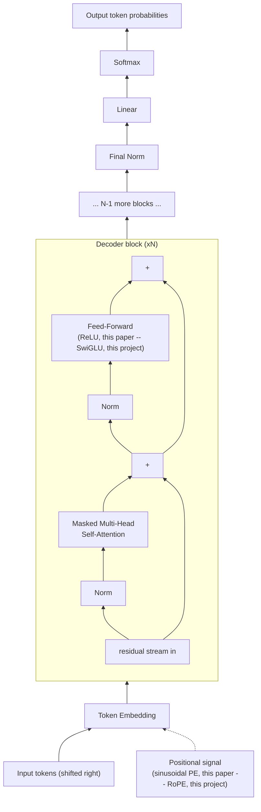
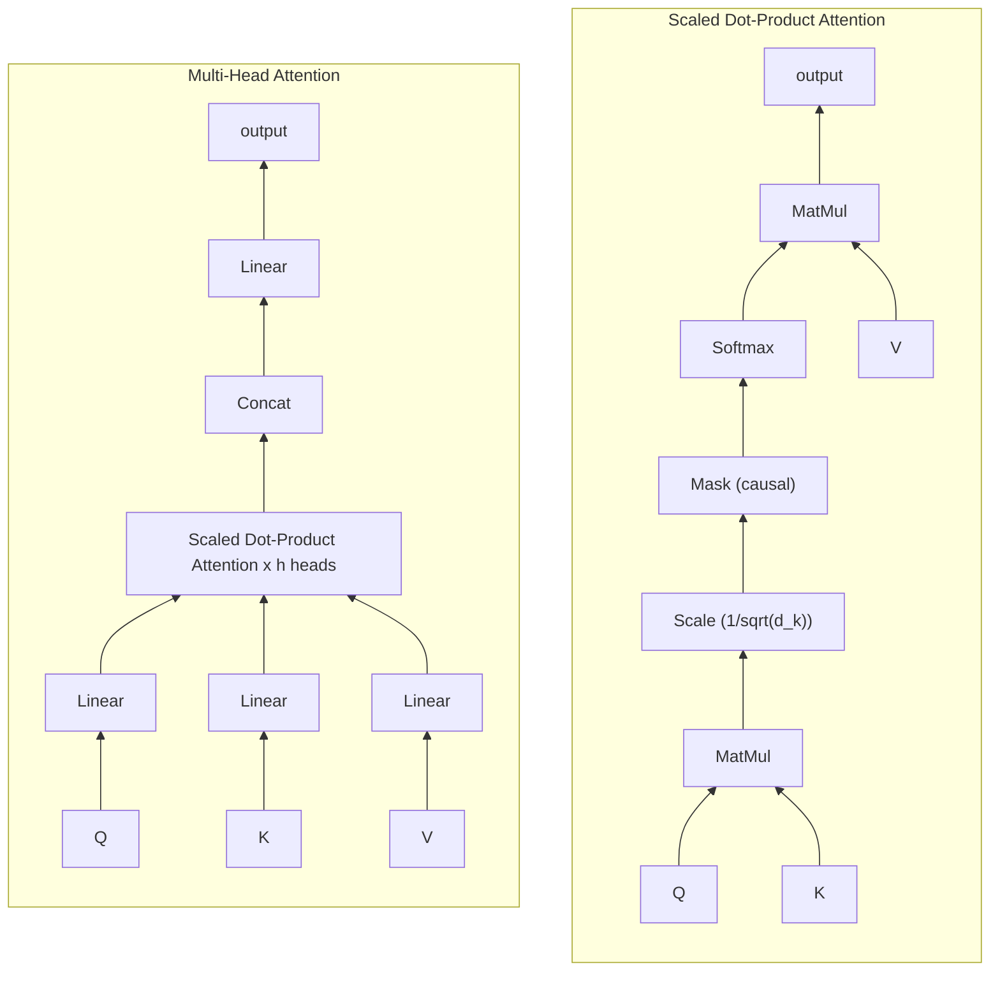

# "Attention Is All You Need" — a page-matched reading companion for this project

> this is a **page-matched companion**: every section below is
> tagged with the exact page(s) in `docs/1706.03762v7.pdf` where it lives, in the same order,
> under the same section numbers, so you can have the real PDF open side by side and flip to
> the named page to read/annotate the original prose directly, while this file carries the
> real equations (not protected expression — reproducing a formula isn't a copyright issue),
> the real data tables (explicitly permitted, quoted below), original-diagram versions of
> Figures 1-2, and this project's own code cross-references, which the raw PDF has no way to
> contain. For the paper on its own, outside this repo: arXiv
> [1706.03762](https://arxiv.org/abs/1706.03762) (v7, 2 Aug 2023 revision).
>
> **Page map** (matches `1706.03762v7.pdf` exactly): p1 title/abstract · p2 §1-2 ·
> p3 Figure 1, §3.1-3.2 · p4 Figure 2, §3.2.1-3.2.2 · p5 §3.2.2-3.4 · p6 Table 1, §3.5, §4 ·
> p7 §4-5.3 · p8 §5.4, Table 2, §6-6.2 · p9 Table 3, §6.3 · p10 Table 4, §7, references ·
> p11-12 references · p13 Figure 3 · p14-15 Figures 4-5.
>

## Why this paper, for this project

Every architectural idea MiniFrontier builds on — attention as a weighted average over
values, scaling by `1/sqrt(head_dim)`, multiple heads instead of one, positional
information injected separately from content, a residual stream running through
normalization and two kinds of sub-layer — traces back to this one paper. `introduction.md`
teaches these ideas from scratch; this file is the other direction: given the real paper,
what does it actually claim, and where does MiniFrontier follow it exactly versus
deliberately diverge (RoPE instead of sinusoidal encoding, RMSNorm instead of LayerNorm,
pre-norm instead of post-norm, SwiGLU instead of ReLU, GQA instead of full multi-head)?

## 1. The problem it solves *(PDF p1-2, Abstract + §1 Introduction)*

Before this paper, the strongest sequence models (translation, language modeling) were
recurrent — an LSTM or GRU processing one token at a time, each step depending on the
previous hidden state. That sequential dependency is the whole problem the paper attacks:
it means training can't parallelize across positions within one sequence, and a signal
between two far-apart tokens has to pass through every step in between, one at a time.
Convolutional alternatives (ByteNet, ConvS2S) parallelize better but still need `O(n)` or
`O(log n)` layers stacked to connect two arbitrary positions.

The paper's claim: drop recurrence and convolution entirely, build the whole model out of
attention, and a signal between *any* two positions crosses in exactly one step, and the
model does not need to look at other tokens sequentially at all to process the current one.

## 2. The architecture, section by section

### 2.1 Encoder-decoder stacks *(PDF p2-3, §2 Background + §3, §3.1)*

The Transformer is an encoder-decoder: the encoder reads the whole input at once and
produces one continuous vector per position; the decoder generates the output one token at
a time, each new token conditioned on everything generated so far plus the encoder's output
(autoregressive generation — see `introduction.md`'s own "what feels like a conversation is
really just the model generating one plausible-sounding reply after another").

- **Encoder**: a stack of `N = 6` identical layers, each with two sub-layers — self-attention,
  then a position-wise feed-forward network. Each sub-layer is wrapped in a residual
  connection followed by layer normalization: `LayerNorm(x + Sublayer(x))`. Every sub-layer
  and the embeddings share one width, `d_model = 512`.
- **Decoder**: also `N = 6` layers, but three sub-layers each — masked self-attention (so a
  position can't attend to later ones), then attention over the *encoder's* output
  ("encoder-decoder attention", queries from the decoder, keys/values from the encoder), then
  the same feed-forward network.

**MiniFrontier**: decoder-only from the start — no encoder stack, no encoder-decoder
attention sub-layer, since MiniFrontier only ever does one thing (continue a sequence of
text), not translate between two different sequences. `TransformerBlock` in `model.py` has
exactly the two sub-layers the paper's *encoder* layer has (self-attention, feed-forward),
each with the same residual-wrap idea — but with the normalization moved to *before* each
sub-layer instead of after (`LayerNorm(x + Sublayer(x))` in the paper vs. this project's own
`x + Sublayer(RMSNorm(x))` pre-norm convention, plus `RMSNorm` instead of `LayerNorm` — see
`introduction.md`'s own "residual stream" section for why pre-norm became the standard
choice after this paper: it keeps the residual path's gradient flow cleaner through very
deep stacks).

### 2.2 Attention *(PDF p3-4, §3.2-3.2.1, Figure 2 left half)*

> Attention(Q, K, V) = softmax(QKT / √dk) · V

A query vector is compared against every key vector (a dot product — how well-aligned two
directions are), scaled down by `1/sqrt(d_k)`, turned into a probability distribution by
softmax, and used to take a weighted average of the value vectors. The paper's own footnote
explains the scaling precisely: for random `q`, `k` with mean 0 and variance 1, their dot
product has variance `d_k` — growing with dimension — and without correcting for that, large
dot products push softmax into a region where its gradient is nearly zero. Dividing by
`sqrt(d_k)` keeps the variance at 1 regardless of dimension.

**MiniFrontier**: this exact formula, three separate times over — `manual_scaled_dot_product_attention`
(`attention.py`, FP32, spelled out step by step, the direct teaching equivalent of this
equation), the SDPA fast path, and the FlexAttention fast path for local layers (see
`labs/00_attention_math.py` and `labs/10_manual_flex_attention.py`, which verify all of this
project's own real code paths against each other and against the real production kernels,
not just against this formula in the abstract).

#### Multi-head attention *(PDF p4-5, §3.2.2, Figure 2 right half)*

> MultiHead(Q, K, V) = Concat(head1, ..., headh) · WO,
> where headi = Attention(QWiQ, KWiK, VWiV)

Rather than one attention computation at the full width `d_model`, the paper projects
queries/keys/values into `h` smaller subspaces, runs attention independently in each, and
concatenates the results back together. The paper's own reasoning: "with a single attention
head, averaging inhibits" a model's ability to attend to different kinds of relationship at
once. The base model uses `h = 8` heads with `d_k = d_v = d_model / h = 64` — narrower per
head, but the total compute is close to one full-width head since the split-and-rejoin is
cheap.

**MiniFrontier**: `CausalSelfAttention` implements this directly for the Edu preset (full
MHA, `n_heads == n_kv_heads`). Modern goes one step further with **GQA** — several query
heads sharing one narrower key/value head, a real, later technique this paper doesn't have
(see `labs/02_mha_vs_gqa.py` for the real memory numbers GQA buys, and `AGENTS.md`'s own
frozen 3:1/4:1 GQA-ratio decisions).

#### The three ways attention gets used *(PDF p5, §3.2.3)*

The paper is explicit that "multi-head attention" isn't one mechanism reused blindly — it's
used three different ways in the same model: encoder self-attention (every position sees
every other input position), decoder self-attention (masked, so a position only ever sees
itself and earlier positions — real causal masking, the same lower-triangular idea
`masking.py`'s `build_attention_mask` implements), and encoder-decoder attention (decoder
queries against encoder keys/values, letting every output position see the whole input).

**MiniFrontier**: only the masked (causal) self-attention case exists, since there's no
encoder and no cross-attention — this project is decoder-only start to finish.

### 2.3 Position-wise feed-forward networks *(PDF p5, §3.3)*

> FFN(x) = max(0, xW1 + b1)W2 + b2

Two linear layers with a ReLU in between, applied identically to every position (the same
weights at every position in a given layer, different weights layer to layer) — the paper
notes this is equivalent to two convolutions with kernel size 1. Width: `d_model = 512` in,
`d_ff = 2048` in the middle, `512` back out — a 4x expansion.

**MiniFrontier**: `SwiGLU` (`model.py`), not plain ReLU — a gated variant
(`down(silu(gate(x)) * up(x))`) that real, later architectures (LLaMA, PaLM, and this
project) adopted specifically because it measurably outperforms ReLU at matched parameter
count. This is one of the clearest "the field moved past this exact 2017 choice" examples in
the whole paper.

### 2.4 Embeddings, softmax, and positional encoding *(PDF p5-6, §3.4-3.5)*

The paper ties three things together: the input embedding, the output embedding, and the
pre-softmax linear projection all share one weight matrix (with the embeddings scaled by
`sqrt(d_model)`) — the same tied-embeddings idea this project's own `tie_embeddings` config
flag implements (default on, matching this paper's own convention).

Since attention has no inherent notion of order — it's a weighted average over a *set*, not
a sequence — the paper injects position explicitly via sinusoidal positional encodings added
to the token embeddings:

> PE(pos, 2i) = sin(pos / 100002i / d_model)
> PE(pos, 2i+1) = cos(pos / 100002i / d_model)

Each dimension of the encoding is a sinusoid at its own frequency, wavelengths forming a
geometric progression. The paper's own stated reason for this specific choice over a learned
positional embedding: it "may allow the model to extrapolate to sequence lengths longer than
the ones encountered during training" — an early version of exactly the long-context
extrapolation problem RoPE scaling (YaRN, NTK-aware methods) was later built to solve
properly.

**MiniFrontier**: RoPE (`rope.py`), not additive sinusoidal encoding. RoPE *rotates* the
query/key vectors by a position-dependent angle rather than adding a position vector to the
token embedding — a later, now-standard technique (LLaMA and effectively every current open
model use it) that makes the *relative* distance between two tokens fall directly out of the
dot product between their rotated vectors, which is the specific property the 2017 paper was
reaching for with its "linear function of a fixed offset" argument but doesn't fully deliver
on its own. See `labs/01_rope.py` for the real, measured version of exactly that relative-
distance property, and this project's own real regex/RoPE-scaling decisions in `AGENTS.md`
(full rotation, `rope_fraction=1.0`, is this project's own frozen default — partial rotation
was tested and found a real, consistent loss, MF-107).

### 2.5 Why self-attention (Table 1) *(PDF p6-7, Table 1, §4)*

The paper's own comparison table, reproduced exactly (permitted under its own notice above)
— `n` is sequence length, `d` is representation width, `k` is convolution kernel size, `r`
is the neighborhood size for restricted (windowed) self-attention:

| Layer Type | Complexity per Layer | Sequential Operations | Maximum Path Length |
|---|---|---|---|
| Self-Attention | O(n² · d) | O(1) | O(1) |
| Recurrent | O(n · d²) | O(n) | O(n) |
| Convolutional | O(k · n · d²) | O(1) | O(log_k(n)) |
| Self-Attention (restricted) | O(r · n · d) | O(1) | O(n/r) |

The paper's own conclusion from this table is directly relevant to this project's own real
architecture: full self-attention is `O(n²)` per layer — cheap when `n` is small relative to
`d` (true at this project's own 1024-2048 context), expensive as `n` grows. Its very last
row, "Self-Attention (restricted)" — attention limited to a neighborhood of size `r` around
each position — is, explicitly in the paper's own words, future work it "plan[s] to
investigate further": *this is the hybrid local/global attention pattern this project's
Modern preset actually implements*, eight years before this project existed. See
`introduction.md`'s own "3.3 Hybrid attention" section and `labs/10_manual_flex_attention.py`
for the real, working version of exactly the idea this table's last row was pointing at.

### 2.6 Training recipe *(PDF p7-8, §5-5.4)*

- **Optimizer**: Adam, `β1=0.9, β2=0.98, ε=1e-9`, with a warmup-then-decay learning-rate
  schedule: `lrate = d_model^-0.5 · min(step^-0.5, step · warmup_steps^-1.5)` —
  linear warmup for `warmup_steps=4000` steps, then inverse-square-root decay.
- **Regularization**: dropout (`P_drop=0.1` for the base model) on every sub-layer output and
  on the embedding+positional-encoding sum, plus label smoothing (`ε_ls=0.1`) — deliberately
  trading worse perplexity for better BLEU/accuracy, since a less falsely-confident model
  generalizes better.

**MiniFrontier**: AdamW (decoupled weight decay, a later refinement of plain Adam) as the
baseline, with the WSD (warmup-stable-decay) schedule instead of this paper's warmup-then-
inverse-square-root — a different, operationally-motivated shape (see `AGENTS.md`'s own real
reasoning: WSD lets an interrupted multi-day run resume without changing the eventual decay
shape, which this paper's own schedule can't do, since its whole curve depends on knowing the
total step count in advance). Dropout defaults to `0.0` here — this project's own models are
limited by how much data they see, not by overfitting, so dropout would only slow learning
(see `labs/00b_attention_pure_python.py`'s own `dropout_1d`, kept for teaching, never turned
on for real training).

### 2.7 Results (Table 2) *(PDF p8, Table 2, §6-6.1)*

The paper's headline result, reproduced exactly:

| Model | BLEU (EN-DE) | BLEU (EN-FR) | Training Cost, FLOPs (EN-DE) |
|---|---|---|---|
| ByteNet | 23.75 | — | — |
| GNMT + RL | 24.6 | 39.92 | 2.3 × 10¹⁹ |
| ConvS2S | 25.16 | 40.46 | 9.6 × 10¹⁸ |
| **Transformer (base)** | **27.3** | **38.1** | **3.3 × 10¹⁸** |
| **Transformer (big)** | **28.4** | **41.8** | 2.3 × 10¹⁹ |

The base model alone beats every prior single model and ensemble on English-to-German, at a
small fraction of their training cost — the paper's central practical claim, not just an
architectural curiosity.

### 2.8 Model variations (Table 3) — the paper's own ablations *(PDF p8-9, §6.2, Table 3)*

The paper varies its own base model along several axes on the same dev set, the direct
precedent for this project's own bounded-ablation discipline (`AGENTS.md`'s "MF-081/082/083's
bounded ablations", every `reports/mf*.md` file):

- **Head count** (row A): 1 head is 0.9 BLEU worse than the best setting; too many heads also
  hurts — there's a real optimum, not "more heads is strictly better."
- **Key/value dimension** (row B): shrinking `d_k` hurts quality — the paper's own read is
  that "determining compatibility is not easy," i.e. a plain dot product may be an
  imperfect compatibility function at very low dimension.
- **Model size / dropout** (rows C, D): bigger models do better; dropout meaningfully helps
  avoid overfitting.
- **Learned vs. sinusoidal position embeddings** (row E): "nearly identical results" — a real
  measured finding that the *specific* positional-encoding scheme mattered less than having
  one at all, at this paper's own scale.

This is precisely the same evidence discipline this project's own `docs/IMPLEMENTATION_DECISIONS.md`
follows — a real, matched-setting table settling a design question empirically rather than
by argument alone.

### 2.9 Generalization: English constituency parsing (Table 4) *(PDF p9-10, §6.3, Table 4)*

A real, striking result the paper includes specifically to show the Transformer isn't
translation-specific: a 4-layer Transformer, applied to parsing (a structurally very
different task — long, constrained-format output) with almost no task-specific tuning,
outperforms every prior discriminative parser except one, and beats the semi-supervised
BerkeleyParser baseline even trained on 40K sentences alone. The paper's own point: the
architecture's generality, not just its translation quality, is the real contribution.

### 2.10 Conclusion and what came after *(PDF p10, §7)*

The paper closes by naming its own future directions: extending the Transformer beyond text
(images, audio, video), and "local, restricted attention mechanisms to efficiently handle
large inputs and outputs." Both became real, major threads in the years since — and the
second one, specifically, is the direct ancestor of this project's own hybrid local/global
attention pattern (Section 2.5 above).

## 3. Figures *(original redraws — real figures are PDF p3 Figure 1, p4 Figure 2, p13-15 Figures 3-5)*

The paper's Figure 1 (the encoder-decoder block diagram) and Figure 2 (scaled dot-product /
multi-head attention diagrams) are reproduced here as original Mermaid diagrams under the
paper's own figure-reuse notice, redrawn rather than image-copied, and adapted to the
decoder-only shape this project actually builds (no encoder, no cross-attention):

Figures 3-5 (PDF p13-15) are the real attention-visualization examples — colored lines drawn
over two actual sentences from the paper's own trained encoder, layer 5 of 6. Worth opening
the PDF for directly rather than described here: Figure 3 (p13) shows several heads on the
sentence *"It is in this spirit that a majority of American governments have passed new laws
since 2009 making the registration or voting process more difficult"* reaching all the way
back across a long clause to connect "making" to "more difficult," the two halves of one
split verb phrase. Figures 4-5 (p14-15) use the sentence *"The Law will never be perfect, but
its application should be just"* — Figure 4 isolates two heads that resolve "its" back to
"Law," real anaphora resolution falling out of nothing but attention weights; Figure 5 shows
two more heads apparently keying off sentence structure rather than any single word. These
are qualitative, translation-task-specific pictures of the paper's own trained model, not
something this project's own (very differently trained, decoder-only, English-only) model
would reproduce identically — they're included here as pointers, not redrawn, since the real
value is in the PDF's own colored line-weights, which an ASCII/Mermaid redraw would flatten
into meaninglessness.

## 4. Where this project follows the paper exactly, and where it deliberately doesn't *(cross-reference, no PDF page — this table exists only here)*

| Component | Paper (2017) | MiniFrontier |
|---|---|---|
| Structure | Encoder-decoder | Decoder-only |
| Normalization | LayerNorm, **post**-norm | RMSNorm, **pre**-norm |
| Position | Additive sinusoidal | RoPE (rotary) |
| Feed-forward | Two linear layers + ReLU | SwiGLU (gated) |
| Attention heads | Full multi-head (Edu matches this) | GQA (Modern) |
| Embeddings | Tied (paper's own choice) | Tied (`tie_embeddings`, same default) |
| Optimizer | Adam, warmup + inverse-sqrt decay | AdamW (+ optional Muon), WSD schedule |
| Local/restricted attention | Named as future work (Section 4) | Implemented (hybrid local/global, Modern) |

None of the differences are corrections of an error in the original paper — they are real,
independently-measured improvements the field converged on over the following years, several
of which this project verified for itself rather than adopted on citation alone (see
`AGENTS.md`'s own bounded-ablation history for exactly which ones).
