# Introduction

**Read this before you open `src/minifrontier/` or run anything in `labs/`.**

This document explains what ChatGPT, Claude, Gemini, Grok and friends actually *are*, and
then walks through the two tiny models in this repo — `tiny_edu` and `tiny_modern` — in
plain language. No maths background needed. Every idea here maps to a real file, class or
line in the source, and the file names are given so you can go look.

---

## Part 0 — The single most important sentence

> **A language model is a machine that guesses the next small piece of text, over and over.**

That's it. That is the whole thing. Everything else — attention, RoPE, GQA, KV caches, all
of it — is engineering to make that one guess *better* and *cheaper*.

When you type a question to Claude and it writes you a 500-word answer, it did not think of
the answer and then type it out. It guessed one small piece. Then it looked at your question
*plus* the piece it just wrote, and guessed the next piece. Then again. Five hundred words
is about 700 guesses, one after another, each one taking the whole conversation so far as
input.

If that sounds too simple to produce something that can debug your code — you're right to be
suspicious. Hold that thought until the end of Part 1.


## How the Process Actually Works

1. Your text is broken into **tokens** (small chunks of characters or words).
2. The model receives a sequence of token IDs (pure numbers).
3. It outputs a score (**logit**) for every possible next token in its vocabulary.
4. Those scores are turned into probabilities (via softmax, after temperature / top-k / top-p filtering).
5. One token is sampled.
6. The chosen token is appended to the context.
7. The process repeats until an end-of-sequence token appears or a length limit is reached.

There is no internal database, no separate “understanding” module, and no truth-checking mechanism. All of the model’s “knowledge” is compressed into millions or billions of numbers called **weights**. These weights were set during training by playing an enormous fill-in-the-blank game: hide the next token, measure how surprised the model is by the real answer, and nudge the weights so it will be less surprised next time.

When the statistical patterns the model learned match reality well, the output looks like reasoning, factual knowledge, or working code. When they do not, the output looks like hallucination or, in extreme cases, incoherent “psychosis.”


---

# Part 1 — What is a chatbot, really?

## 1.1 Text is chopped into LEGO pieces called **tokens**

Computers can't work with letters directly, and working with whole words is wasteful (there
are millions of words, plus typos, plus code, plus Hebrew, plus emoji). So text gets chopped
into pieces that sit in between: **tokens**.

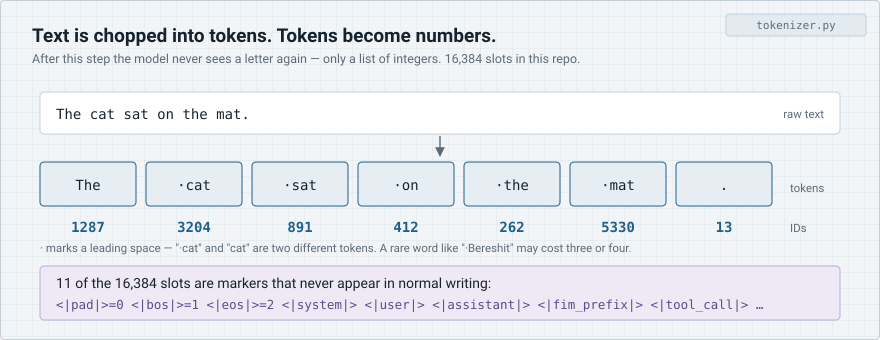

A token is usually a common chunk of characters. `" the"` is one token. `" hello"` is one
token. A weird word like `" Bereshit"` might be three or four tokens. A single emoji might
be two.

This repo's tokenizer (`src/minifrontier/tokenizer.py`) has exactly **16,384 tokens** in its
vocabulary — that's `VOCAB_SIZE`. Big commercial models use 100,000–200,000, but the idea is
identical.

Eleven of those slots are **special tokens** — pieces of text that never appear in normal
writing, used as markers:

```
<|pad|> <|bos|> <|eos|> <|system|> <|user|> <|assistant|>
<|fim_prefix|> <|fim_suffix|> <|fim_middle|> <|tool_call|> <|tool_result|>
```

Each token has an ID number. `<|pad|>` is 0, `<|bos|>` ("beginning of sequence") is 1, and
so on. **From here on, the model never sees letters again — only lists of ID numbers.**

## 1.2 The chat you see is a lie (a friendly one)

You see a chat window with bubbles. The model sees one long flat string of tokens.

Look at `templates/chat_template.jinja` in this repo — this is the entire trick:

```jinja
<|bos|><|{{ message.role }}|>
{{ message.content }}<|eos|>
<|assistant|>

```

Your conversation gets flattened into something like:

```
<|bos|><|system|>You are helpful.<|eos|><|user|>What is 2+2?<|eos|><|assistant|>
```
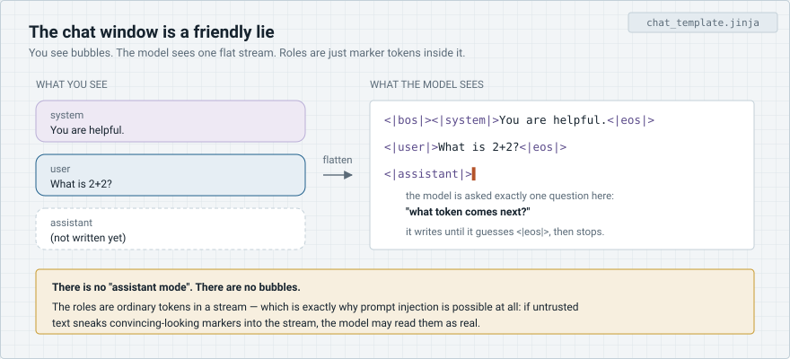

...and then the model is asked its one and only question: *what token comes next?* It has
learned that after `<|assistant|>` comes assistant-flavoured text, so it starts writing an
answer. It stops when it guesses `<|eos|>`.

There is no "assistant mode". There are no bubbles. **The roles are just marker tokens in a
stream of text.** That's why "prompt injection" is possible at all — if untrusted text can
sneak convincing-looking markers into the stream, the model may treat them as real.

## 1.3 The guessing loop (autoregression)

Here is the actual loop, from `src/minifrontier/generation.py`:

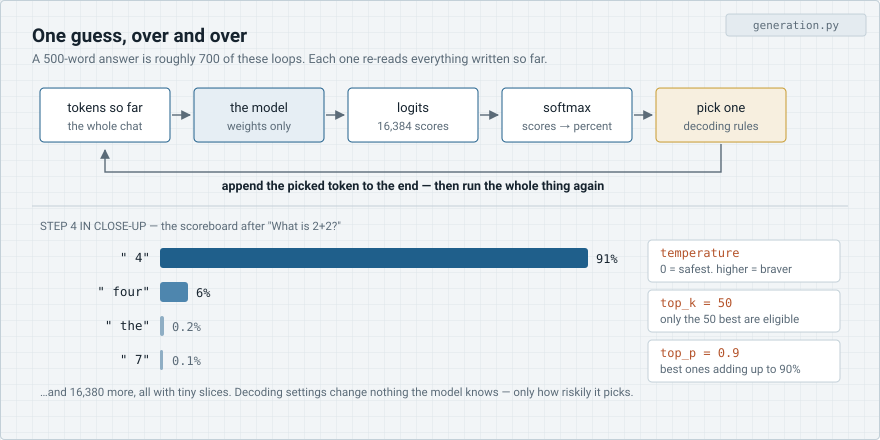

1. Feed all the tokens so far into the model.
2. The model outputs a **score for every one of the 16,384 possible next tokens**. These
   scores are called **logits**.
3. Turn those scores into percentages (**softmax**): maybe `" 4"` gets 91%, `" four"` gets
   6%, `" the"` gets 0.2%, and so on.
4. Pick one.
5. Stick the picked token onto the end, and go back to step 1.

Step 4 is where **temperature**, **top-k** and **top-p** live — they're all just rules for
*how adventurous* the pick is:

| Setting | What it means, in kid terms |
|---|---|
| `temperature = 0` | Always pick the single highest-scoring token. Boring, repetitive, but predictable. This is `argmax` in the code. |
| `temperature = 0.8` | Flatten the odds a bit so less-likely tokens get a real chance. More creative, more mistakes. |
| `top_k = 50` | Only ever pick from the 50 best candidates. Ignore the rest completely. |
| `top_p = 0.9` | Take the best candidates until their percentages add up to 90%, pick from those. |

These are **decoding** settings. They change nothing about what the model knows — only how
riskily it picks from what it already scored.

## 1.4 So where does the "knowing" come from?

Inside the model are millions (or trillions) of numbers called **weights** or
**parameters**. `tiny_edu` in this repo has **28,832** of them. GPT-4-class models have
hundreds of billions. These numbers are the *entire* memory of the model.

Those numbers got set during **training**, which is a fill-in-the-blank game played
astronomically many times:

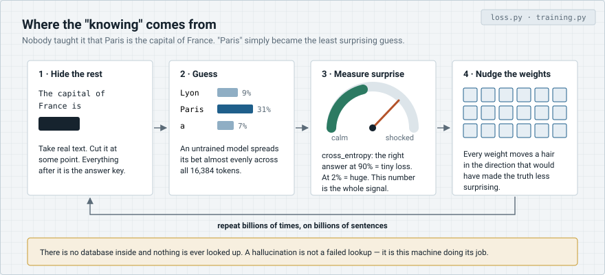

1. Take a real sentence from real text.
2. Hide everything after some point.
3. Ask the model to guess the next token.
4. Compare its guess to the real answer and compute a **surprise score** — how shocked the
   model was by the truth. In code this is `next_token_loss` in `src/minifrontier/loss.py`.
5. Nudge every weight a tiny bit in the direction that would have made the model less
   surprised. (This is **backpropagation** + an **optimizer** — `AdamW` in
   `src/minifrontier/training.py`.)
6. Repeat, billions of times, on billions of sentences.

Nobody ever taught it that Paris is the capital of France. It read that sentence pattern
enough times that "Paris" became the least-surprising guess after "the capital of France
is". Facts, grammar, arithmetic, coding style — all of it is compressed into those weights
as *what makes text less surprising*.

**Crucially: the model does not look anything up.** There is no database inside. There is no
copy of Wikipedia. There are only weights. When a model gives you a wrong fact confidently —
a **hallucination** — that's not a bug in a lookup, it's the machine doing exactly its job:
producing text that *pattern-matches* plausible, without any mechanism that checks truth.

When Claude or ChatGPT searches the web for you, that's genuinely different: the search
result text gets pasted into the token stream as extra context, and *then* it guesses. The
guessing machine hasn't changed; it just got better input.

 How does “guess the next token” produce working code, coherent arguments, or correct facts?
 
 Because the training data contains almost every pattern humans have written down. To keep being surprised less often, 
 the model is forced to notice regularities that actually help prediction:Grammar is useful: after “the cat sat on the”, “mat” is far less surprising than “quickly”.
Facts are useful: after “the capital of France is”, “Paris” scores higher than “Berlin”.
Code structure is useful: after def add(a, b): return, the tokens a + b are more predictable than random characters.
Simple reasoning patterns are useful: after “If all A are B, and X is an A, then X is”, the continuation “a B” becomes the low-surprise choice.

None of these were programmed in. They emerged as side-effects of getting better at the single narrow job. 
The bigger the model and the more diverse the text, the more of these useful internal circuits appear. 
That is what people mean by “emergent abilities.”

Emergent does not mean magical. The model is still only doing next-token prediction. It has no separate module that “understands,” “plans,” or “checks truth.” When it solves a hard problem, it is because the pattern of tokens that solves the problem was the least-surprising continuation given everything it has seen.

so the model has compressed so many statistical regularities into its weights that the most probable next tokens often look like thinking


## 1.5 Two more honest things , and about SFT — supervised fine-tuning

**It doesn't remember you.** Each request starts fresh. What looks like memory is either
(a) the whole conversation being re-sent every single time, or (b) a separate notes system
that pastes saved facts back into the prompt.

**Chat models had a second training stage.** A model trained only on step 1.4 will happily
continue your question with *more questions*, because that's what internet text does. To
make it answer instead, you train it further on examples of "user says X, good assistant
replies Y", and only score it on the assistant's half. That's **SFT** — supervised
fine-tuning — and this repo does it in `train/sft.py` and `src/minifrontier/sft.py`. The
`loss_mask` argument you'll see threaded through the code exists exactly for this: *only
learn from the assistant's words, not the user's.*

Now — back to that suspicion from Part 0. How does "guess the next token" produce working
code? Because to guess the next token *really well* across all of human text, the cheapest
strategy available to the machine turns out to be learning grammar, facts, logical
structure, and code semantics. Prediction is the training goal; understanding-shaped
machinery is what it grows in order to hit that goal.

---

# Part 2 — `tiny_edu`, box by box

Now we open the box. `tiny_edu` is defined in `src/minifrontier/config.py` as
`ModelConfig.tiny_edu()` and built by the `MiniFrontier` class in
`src/minifrontier/model.py`.

## 2.0 How small is small?

| Knob | Value | What it means |
|---|---|---|
| `vocab_size` | 64 | Only 64 different tokens exist (toy alphabet) |
| `max_seq_len` | 32 | Can look at 32 tokens at once, maximum |
| `n_layers` | 2 | Two thinking rounds |
| `d_model` | 32 | Each token is described by 32 numbers |
| `n_heads` | 4 | Four "listeners" per round |
| `head_dim` | 8 | 32 ÷ 4 = each listener works with 8 numbers |
| `d_ff` | 96 | The thinking room is 3× wider than the corridor |
| **total weights** | **28,832** | About the size of a small spreadsheet |

That's small enough to run on any laptop, in a test, in a second. And it is **exactly the
same code** that runs the 150M-parameter version — same classes, same file, different
numbers. That's the whole design idea of this repo.

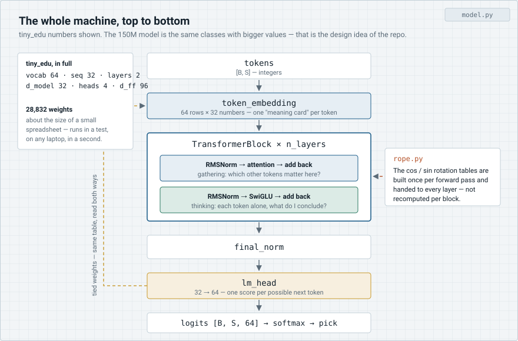

## 2.1 Step one: tokens become "meaning cards" (embedding)

```
tokens [B, S]  →  nn.Embedding(64, 32)  →  hidden [B, S, 32]
```

Imagine a filing cabinet with 64 index cards, one per token. Each card has 32 numbers
written on it. Those numbers are the token's **meaning card** — they start as random
nonsense and, during training, drift so that similar tokens end up with similar cards.

`B` is the batch (how many sentences at once), `S` is how many tokens long.

From here on, every token in the sentence is a list of 32 numbers, and those numbers get
edited over and over as they travel up through the model. That travelling list is called the
**residual stream**, and it's the single most useful mental image in this whole document:

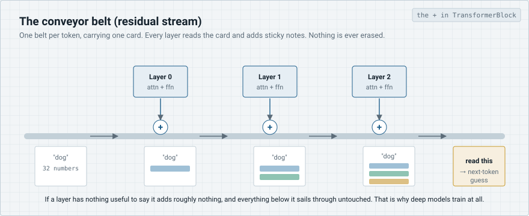

> **Picture a conveyor belt, one per token, carrying a card. Each layer of the model reads
> the cards, and adds sticky notes to them. Nothing is ever erased. At the top, we read the
> final card and turn it into a guess.**

## 2.2 Step two: stamping positions (RoPE)

Problem: attention (coming next) sees all tokens as an unordered pile. "Dog bites man" and
"man bites dog" would look identical. We need to tell it the order.

Solution in this repo: **RoPE**, Rotary Position Embedding
(`src/minifrontier/rope.py`).

Kid version: give each token's numbers a **twist**, and twist token #5 more than token #2.
Take the 8 numbers of a head, treat them as 4 little arrows (pairs), and *rotate each arrow
by an angle that depends on where the token sits in the sentence*. Token 0 gets no rotation,
token 1 a little, token 7 more.

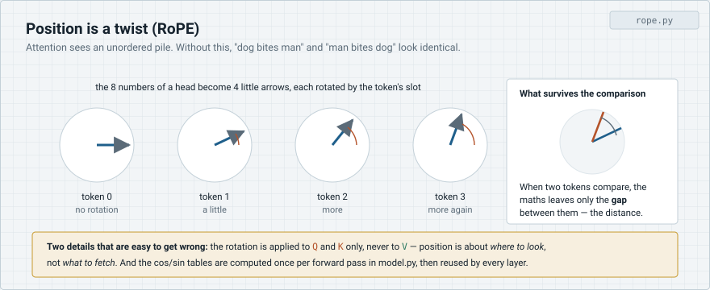

The clever bit: when two tokens later compare themselves against each other, the maths works
out so that what matters is the **difference** between their rotations — that is, *how far
apart they are*. So the model learns about distance rather than about absolute slot numbers.

Two details worth noticing in the code:

- The rotation tables (`cos`, `sin`) are computed **once per forward pass** in
  `model.py`, then handed to every layer. Not recomputed per layer.
- The rotation is applied to Q and K only — never to V. (Reason: it's about *where to look*,
  not *what to fetch*.)

## 2.3 Step three: the Transformer Block, repeated

`TransformerBlock` in `model.py` is 30 lines and it does exactly two things, both in the same
shape:

```python
inputs = inputs + self.attention(self.attention_norm(inputs), ...)
return inputs + self.feed_forward(self.ffn_norm(inputs))
```

Read that as: **normalize → do something → add the result back onto the conveyor belt.**

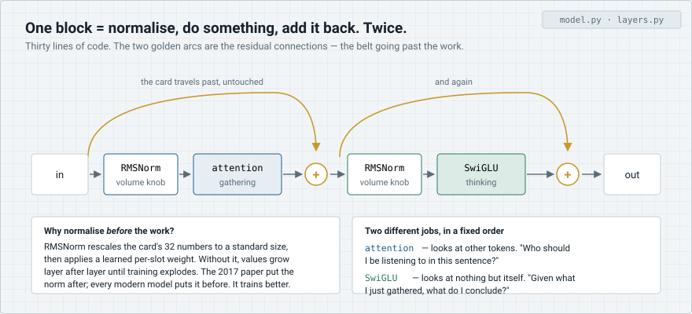

Three ideas are packed into those two lines:

**(a) The `+` is the residual connection — the conveyor belt.** The block never *replaces*
the token's card, it only adds a sticky note. That's why a 20-layer model can work at all:
if layer 12 has nothing useful to say, it can add roughly nothing and the information from
layer 11 still sails through untouched. Without this, deep networks are very hard to train.

**(b) The norm comes *before* the work — "pre-norm".** `RMSNorm`
(`src/minifrontier/layers.py`) is a volume knob: it takes the 32 numbers on a card and
rescales them so their overall size is standard, then multiplies by a learned per-slot
weight. Without it, numbers can grow layer after layer until training explodes. Old
Transformers (2017) put the norm after; every modern model puts it before, because it trains
much more reliably.

**(c) Attention first, then the feed-forward.** Two different jobs:

- **Attention = gathering.** "Which other words in this sentence should I be paying
  attention to?"
- **Feed-forward = thinking.** "Given everything I just gathered, what do I conclude?" This
  one looks at each token completely on its own.

## 2.4 Attention, explained with a classroom

This is the famous part. `CausalSelfAttention` in `src/minifrontier/attention.py`.

Picture a classroom where every child is one token. Each child does three things at once:

- Writes a **Query** on a card: *"here's what I'm looking for"* — e.g. the word `it` might
  be looking for "a recent noun".
- Wears a **Key** name tag: *"here's what I am"* — the word `dog` advertises "I'm an
  animal noun".
- Holds a **Value** envelope: *"here's what I'll hand you if you pick me"*.

In code those are three plain matrix multiplications with no bias:
`q_proj`, `k_proj`, `v_proj`.

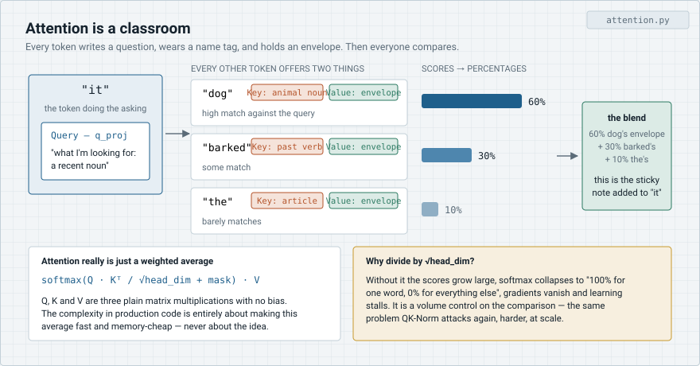

Now every child compares their Query against **everyone's** name tag. High match = high
score (`Q · Kᵀ`). The scores get turned into percentages with softmax — so each child ends
up with something like "60% dog, 30% barked, 10% the". Then they collect a **blend of
everyone's envelopes, weighted by those percentages**, and that blend becomes their sticky
note.

Three extra rules make it work:

**No peeking at the future (the causal mask).** Because the model's whole job is guessing
what comes next, letting it see the future would be cheating and would teach it nothing. So
token 5 can look at tokens 0–5 and *nothing after*. In `src/minifrontier/masking.py` that's
one line: `key_positions <= query_positions`. Draw it as a triangle — the lower-left
triangle of a grid is allowed, the upper-right is blocked.

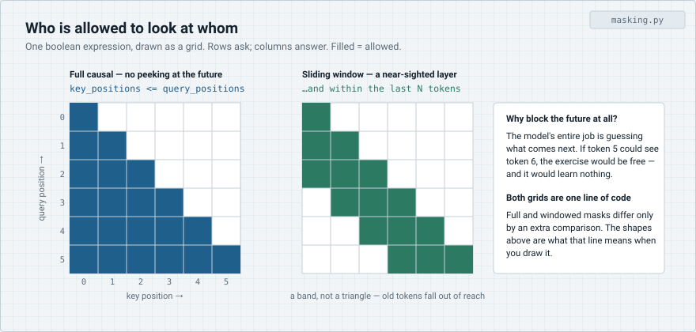

**Divide by √head_dim.** Before softmax, the scores get shrunk by the square root of the
head size. Without this, the scores get big, softmax turns into "100% for one word, 0% for
everything else", and learning stalls. It's a volume control on the comparison.

**Multiple heads.** One listener isn't enough — a word might need to track grammar *and*
subject *and* tone at once. So the 32 numbers get split into 4 groups of 8, and the entire
classroom exercise runs **4 times in parallel with 4 different sets of Q/K/V weights**. One
head may learn "find the verb", another "find the matching bracket". Their four answers get
glued back together into 32 numbers, and one last matrix (`out_proj`) mixes them.

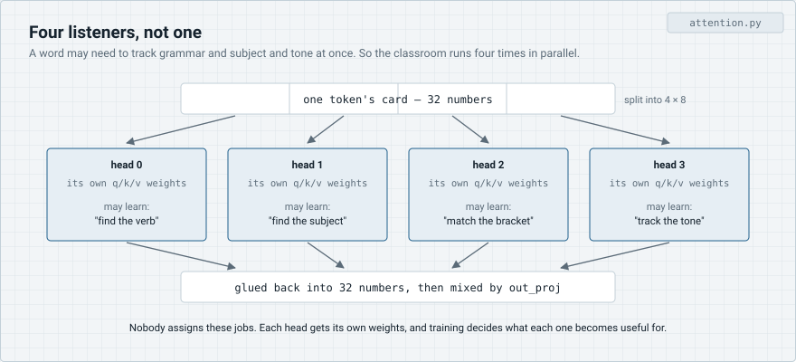

In `tiny_edu` this is **MHA** — Multi-Head Attention — meaning 4 queries, 4 keys, 4 values.
Everybody has their own everything. Remember this; it's the first thing `tiny_modern`
changes.

### The two twin implementations

`attention.py` contains the same maths written twice on purpose:

- `manual_scaled_dot_product_attention` — the teaching version. `softmax(QKᵀ/√d + mask) · V`
  spelled out, with an explicit boolean mask. Slow, readable, correct.
- `F.scaled_dot_product_attention` — PyTorch's built-in fused version. Same answer, far
  faster and far less memory, because it never builds the giant score matrix in one piece.

The tests check they agree. Read the manual one to learn; run the fast one for real.

## 2.5 The thinking room (SwiGLU)

`SwiGLU` in `src/minifrontier/layers.py`:

```python
down(silu(gate(x)) * up(x))
```
It is the “thinking” part of the block — the part that looks at one token at a time (no mixing with other tokens).

Each token, alone, gets expanded from 32 numbers to 96 (a bigger room to think in), then
squeezed back down to 32.

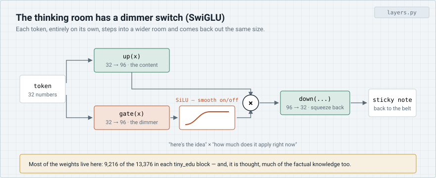

The `gate` part is a **dimmer switch**. Two copies of the widened token are made: `up` is
the content, `gate` is passed through a smooth on/off curve (SiLU) and multiplied in, so it
can turn individual features up, down, or off. It's "here's the idea" × "how much does this
idea apply right now".

This is where most of the model's weights live — in `tiny_edu`, 9,216 of 13,376 per block —
and where a lot of the raw factual knowledge is thought to be stored.

x = x + attention(norm(x))      # gather information from other tokens
x = x + feed_forward(norm(x))   # ← SwiGLU happens here (think alone)
SwiGLU processes each token independently and adds its conclusion back onto the residual stream.

Simple mental model:
Attention = “Who should I listen to?”
SwiGLU = “Given what I just heard, what do I conclude about this token?”
That is the complete mechanics of SwiGLU 


Most of the model’s parameters live in the three SwiGLU matrices (especially in larger models).


## 2.6 Step four: turning a card back into words

At the very top (`model.py`):

```
final_norm → lm_head (32 → 64) → logits [B, S, 64]
```

`lm_head` is a scoreboard: it takes the final 32-number card and produces one score for each
of the 64 possible tokens. Softmax turns those into percentages, and Part 1's picking rules
choose one.

**Tied embeddings** (`tie_embeddings = true`): the scoreboard reuses the *exact same
weights* as the meaning-card cabinet from step 2.1 — `lm_head.weight =
token_embedding.weight`. Same table read in both directions: "ID → meaning" on the way in,
"meaning → ID" on the way out. Saves memory and generally helps small models.

## 2.7 How it learns (training)

`next_token_loss` in `loss.py` does something you should look at, because it's a one-line
idea that confuses everyone the first time:

```python
shifted_logits = logits[:, :-1, :]  # my guesses, ignoring the last position
targets = tokens[:, 1:]  # the real answers, shifted left by one (in mtp[multi-token prediction] head: it also shift by 2)
```

Every position guesses its *neighbour to the right*. So one sentence of 32 tokens gives you
31 training examples simultaneously, not one. That's why this is so efficient.

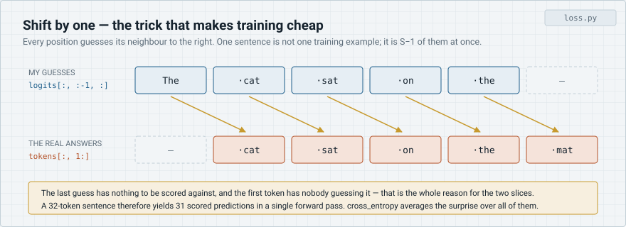

`cross_entropy` is the surprise-o-meter. Guessed the right token with 90% confidence → tiny
loss. Guessed it with 2% confidence → big loss. Average across all positions, then
backpropagate.

From `src/minifrontier/training.py`, the grown-up knobs:

- **AdamW** — the optimizer. Not just "nudge in the good direction" but "nudge, with memory
  of recent nudges, and per-weight step sizes".
- **Warmup then cosine decay** — start with a tiny learning rate for the first 100 updates
  (big steps early on wreck a random model), ramp up, then smoothly slow down to almost
  nothing. `WarmupCosineSchedule`.
- **Gradient clipping at 1.0** — if a nudge is enormous, shrink it. Prevents one weird batch
  from destroying hours of training.
- **Weight decay 0.1** — gently pull weights toward zero unless the data insists otherwise.
  Discourages memorizing.
  
  
  Post-training beyond SFT:
  SFT is only the second stage. After a model has learned to continue text and then learned to answer instead of continue, 
  commercial chat models almost always get a third stage of training. People collect pairs of answers — one better, one worse — and teach the model to prefer the better one. 
  The 2 most common recipes are RLHF (Reinforcement Learning from Human Feedback/or verifier tool automatically) 
  and DPO (Direct Preference Optimization).
  
  SFT is “here are many examples of good answers — copy this style.” 
  Preference training is “here are two answers to the same question; this one is better, that one is worse — move toward the better one.” 
  The model still only ever predicts the next token. 
  The training signal just becomes “make the tokens of the preferred answer more likely and the tokens of the rejected answer less likely.”
  
  This is why Claude or ChatGPT feels more helpful, less sycophantic, and more careful than a pure SFT model. 
  
  It is also why the same base model can be turned into different products: the core guessing machine stays the same; 
  the preference data and the third training stage shape its personality and safety behaviour. 
  This repo stops at SFT (train/sft.py and the loss_mask) because that is enough to understand the architecture. 
  The extra alignment stage does not change any of the boxes


## 2.8 The notebook that makes chat fast (KV cache)

Naive generation is absurdly wasteful. To write word 100, you'd re-run all 99 previous
tokens through all layers — and you did the same thing for word 99, and 98...

But notice: **the Keys and Values of old tokens never change.** Token 3's name tag and
envelope are the same whether the sentence is 10 or 500 tokens long (they only depend on
tokens 0–3, which are already fixed).

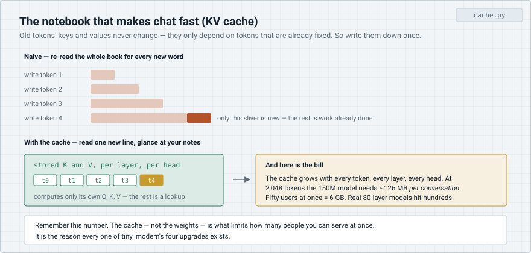

So: write them down once and keep them. That's the **KV cache**
(`src/minifrontier/cache.py`). Now each new token needs only *its own* Q, K, V computed,
plus a lookup of everything cached. Generation goes from "re-read the whole book each word"
to "read one new line and glance at your notes".

The price is memory — the cache grows with every token, for every layer. Remember this
sentence. It's the reason `tiny_modern` exists.

---

# Part 3 — `tiny_modern`: four upgrades and why

Here's the thing that surprises people: **the two models are the same code.** Same
`MiniFrontier` class, same `TransformerBlock`, same `SwiGLU`, same `RMSNorm`, same residual
stream, same loss, same tokenizer. `tiny_modern` flips four switches in `ModelConfig`.

That's not a shortcut in this repo — that's roughly what actually happened in the field
between 2019 and 2025. The 2017 skeleton survived; people fixed four specific pain points.

| | `tiny_edu` | `tiny_modern` | Pain point it fixes |
|---|---|---|---|
| Heads | MHA (4 Q, 4 KV) | **GQA** (4 Q, 2 KV) | KV cache eats all your memory |
| Norms | pre-norm only | **+ QK-Norm** | Training blows up at scale |
| Attention span | full, every layer | **3 local + 1 global** | Attention cost grows quadratically |
| Position | RoPE everywhere | RoPE, **optional NoPE on global layers** | Long-context behaviour |

## 3.1 GQA — four askers share two note-takers

**The problem.** In section 2.8 we cached K and V for every layer and every head. For the
real 150M Edu model with a 2,048-token context, that's about **126 MB of cache per
conversation**. Run 50 users at once and you've spent 6 GB on notes alone. Real models with
80 layers and 32k contexts hit hundreds of gigabytes. The cache, not the weights, becomes
the thing that limits how many people you can serve.

**The observation.** The *queries* need to be diverse — that's the model asking different
questions. But do you really need 4 separate name tags and 4 separate envelopes? Turns out:
mostly no.

**The fix.** Keep 4 Query heads. Use only **2** Key/Value heads. Heads 0 and 1 share KV
group 0; heads 2 and 3 share KV group 1. In `config.py`, `queries_per_kv = 2`.

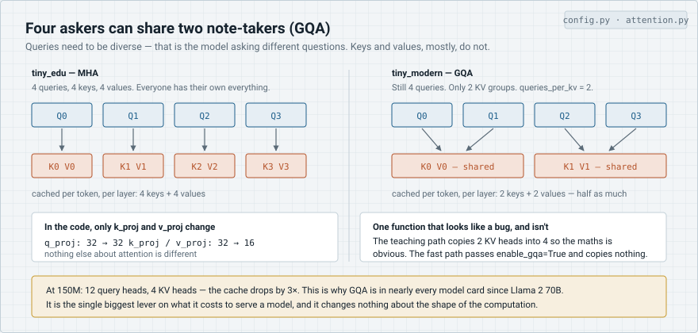

In the code, `k_proj` and `v_proj` output 16 numbers instead of 32:

```python
self.q_proj = nn.Linear(d_model, n_heads * head_dim, bias=False)  # 32 → 32
self.k_proj = nn.Linear(d_model, n_kv_heads * head_dim, bias=False)  # 32 → 16
self.v_proj = nn.Linear(d_model, n_kv_heads * head_dim, bias=False)  # 32 → 16
```

Same trick at 150M scale: 12 Q heads, 4 KV heads → cache drops by 3×.

One detail worth understanding, because it shows up as a strange-looking function in the
source. The *teaching* path physically copies the 2 KV heads into 4
(`_expand_kv_for_reference` → `repeat_interleave`) so the maths is obvious. The *fast* paths
just pass `enable_gqa=True` and let the kernel share them without ever making a copy. Same
result; one is for reading, one is for running.

This is why "GQA" appears in nearly every model card since Llama 2 70B. It's the single
biggest lever on serving cost.

## 3.2 QK-Norm — a volume limiter on the question and the name tag

**The problem.** When models get big, the Q·K scores sometimes grow enormous. Softmax then
saturates: one word gets 100%, everything else gets 0%. Gradients vanish, and the training
loss suddenly spikes to nonsense — often thousands of GPU-hours in. It's one of the classic
ways a big training run dies.

**The fix.** Put an `RMSNorm` on Q and on K — the same volume knob from section 2.3, but
applied *per head*, on `head_dim = 8` numbers:

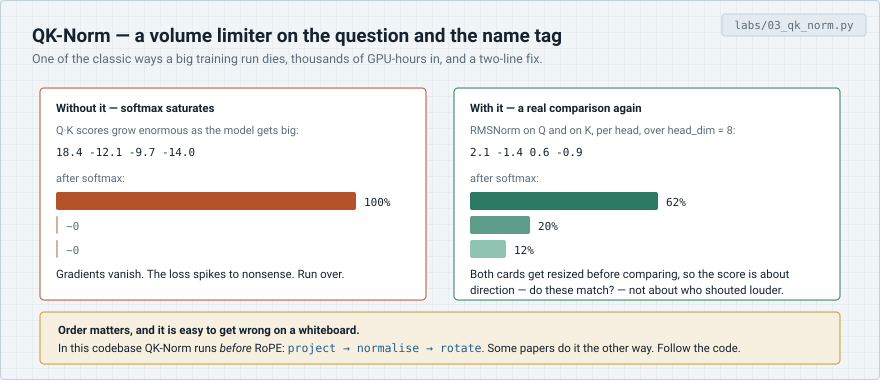

```python
self.q_norm = RMSNorm(self.head_dim, eps=config.norm_eps) if config.qk_norm else None
self.k_norm = RMSNorm(self.head_dim, eps=config.norm_eps) if config.qk_norm else None
```

Kid version: before two children compare cards, both cards get resized to a standard size.
Now the comparison is about *direction* — do these match? — not about *who shouted louder*.

**Order matters, and it's easy to get wrong on a whiteboard.** In this codebase, QK-Norm
runs **before** RoPE (`attention.py`, lines 171–176): project → normalize → rotate. Some
papers do it the other way. Follow the code.

`labs/03_qk_norm.py` runs two identical Modern models, one with the flag on and one off, so
you can see the effect directly.

## 3.3 Hybrid attention — three near-sighted layers, one far-sighted

**The problem.** Full attention layers (like in edu) means every token looks at every earlier token. Double the
context, quadruple the work. That quadratic wall is the reason long context is expensive.

**The observation.** Most of language is local. To finish `"the cat sat on the ___"` you
need the last six words, not paragraph three. Only *occasionally* do you need the long
reach — a variable declared 400 lines up, a name from the top of the document.

**The fix.** Don't make every layer far-sighted. Make most of them near-sighted and cheap,
and put a proper long-range layer in every so often (3 local 1 global).

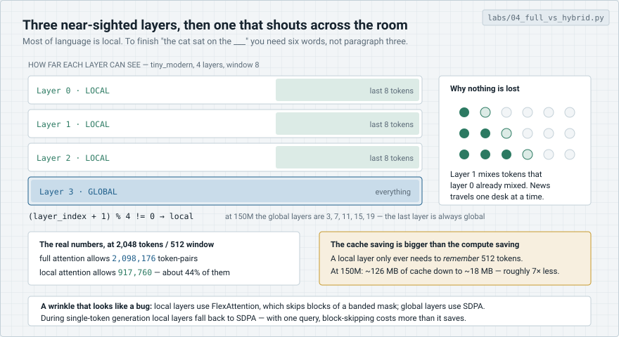
In `config.py`, one line does it:

```python
def is_local_layer(self, layer_index: int) -> bool:
    return self.attention_pattern == "hybrid" and (layer_index + 1) % 4 != 0
```

So in `tiny_modern` (4 layers):

```
Layer 0 — LOCAL  (sees only the last 8 tokens)
Layer 1 — LOCAL  (sees only the last 8 tokens)
Layer 2 — LOCAL  (sees only the last 8 tokens)
Layer 3 — GLOBAL (sees everything)
```

At 150M (20 layers) the global layers are 3, 7, 11, 15, 19 — and the last layer is always
global, which is deliberate.

**Why doesn't the local layer lose information?** Because of the conveyor belt. Layer 0
mixes each token with its 8 neighbours. Layer 1 mixes *those already-mixed* tokens with
*their* 8 neighbours — so information has effectively travelled 16 tokens. Like a rumour
spreading across a classroom: nobody shouts across the room, but the news still gets
everywhere, one desk at a time. And every fourth layer, someone *does* shout across the
room.

`labs/04_full_vs_hybrid.py` prints the real numbers. For 2,048 tokens with a 512 window:
full attention allows **2,098,176** token-pairs; local allows **917,760** — about 44%. And
that's at a short context; the gap widens fast as context grows.

The cache saving is larger still, because the local layers only need to *remember* 512
tokens, ever. For the 150M model at 2,048 context, KV cache drops from ~126 MB to ~18 MB —
roughly **7× less**, combining GQA and hybrid.


Here are two beginner-friendly sections written in the same plain-language style as the rest of `introduction.md`. You can paste them in (they expand and clarify the existing material around hybrid attention and NoPE).

---

### Attention kernels — how the model actually does the “looking”

Attention is just a weighted average of other tokens. The *math* is always the same:

```text
scores = (Query · Keyᵀ) / √head_dim
weights = softmax(scores + mask)
output  = weights · Value
```

What changes is *which piece of code* runs that math. Different masks and different sequence lengths favour different kernels, so the model picks the cheapest correct one.

**Edu (the simple preset)**  
Every layer is full causal attention. The default kernel is **SDPA** (`F.scaled_dot_product_attention`).  
SDPA is PyTorch’s fused, highly optimised path. It never builds the huge score matrix in one piece, and it has a specially fast path for the ordinary “lower-triangular causal” mask that Edu uses everywhere. You can force the slow, readable teaching path with `attention_impl = "manual"` if you want to see every number; the tests check that both paths give the same answer.

**Modern (the hybrid preset)**  
Local layers and global layers have *differently shaped* masks, so they prefer different kernels. The config setting is `attention_impl = "auto"`. That single word means:

- **Local layers** (the short-sighted ones that only look back `local_window` tokens) → **FlexAttention**.  
  Flex is told “banded diagonal”. Whole rectangular tiles of the score grid are guaranteed to be masked out, so Flex can skip them completely. That is where the speed-up on long sequences comes from. The block-mask object is built once and cached (`_BLOCK_MASK_CACHE` in `attention.py`).

- **Global layers** (the far-sighted ones that see the whole history) → **SDPA**.  
  A plain causal triangle is exactly what SDPA’s fused fast path is already tuned for, so there is no need for Flex.

There is one extra rule that looks surprising until you know why it exists: during single-token generation a local layer *downgrades* from Flex back to SDPA. With only one query row there is no big sparse grid left to skip — only compile and launch overhead — so SDPA is cheaper. That decision lives in `CausalSelfAttention.resolved_implementation`.

You can override the choice per call (`attention_impl="manual"`, `"sdpa"` or `"flex"`) when you are measuring or debugging. The tests assert that all three paths agree within a tight tolerance.

In short:

| Preset  | Default setting | What actually runs                          |
|---------|-----------------|---------------------------------------------|
| Edu     | `"sdpa"`        | SDPA on every layer                         |
| Modern  | `"auto"`        | Flex on local layers, SDPA on global layers |

The maths never changes; only the engine that evaluates it does.


### Different layers, different fast paths

Because local and global layers have differently-shaped masks, they run best on different
kernels. `attention_impl = "auto"` sorts it out per layer:

- **local layers → FlexAttention** — a PyTorch feature for custom mask shapes. It's told
  "banded diagonal" and can skip entire blocks of the score matrix that are guaranteed
  masked out. The `BlockMask` gets built once and cached (`_BLOCK_MASK_CACHE`).
- **global layers → SDPA** — the standard fused kernel, which already has a fast path for
  "plain causal".

There's one further wrinkle worth knowing since it looks like a bug otherwise: during
single-token generation, local layers *downgrade* from Flex back to SDPA
(`resolved_implementation`). With only one query token, Flex's block-skipping machinery
costs more than it saves.

---


### The whiteboard-with-limited-space trick (ring cache)

If a local layer only ever looks back 512 tokens, storing 100,000 is pointless. So local
layers get a **ring buffer**: a whiteboard with exactly 512 slots. Slot 513 overwrites slot
1. `LayerKVCache` with `ring=True` does this with `index_copy_` and a modulo. Memory stops
growing entirely for those layers, no matter how long the conversation gets.

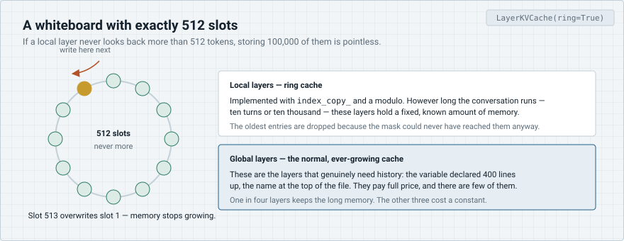

Global layers keep the normal ever-growing cache — they're the ones that actually need the
history.

## 3.4 NoPE on global layers (the experiment)

`global_position_encoding` can be `"rope"` (default) or `"none"`.

With `"none"`, the global layers get **no position stamp at all** — they see an unordered
pile of tokens. Sounds broken. The idea: the local layers below already baked ordering into
the cards, so the global layer can lean on that, and *not* having a rotation that was only
ever trained up to 2,048 positions may help when you later push to much longer contexts.

The config guards this — NoPE is only legal on hybrid models, because it only makes sense if
there *are* local layers underneath doing the position work.

This one is genuinely an open question in the field, which is why the repo labels it an
experiment and gives it a lab: `labs/07_rope_vs_global_nope.py`.

**RoPE** (Rotary Position Embedding) is the normal way this model stamps position onto every token.  
It rotates the Query and Key vectors of each token by an angle that depends on that token’s absolute position. When two tokens are later compared with a dot-product, the two rotations partly cancel and what survives depends on *how far apart* the tokens are. That relative-distance signal is what lets the model tell “dog bites man” from “man bites dog”. RoPE is applied only to Q and K, never to V, and it has no learned parameters — pure arithmetic.

**NoPE** simply means “No Position Encoding”.  
When a layer is configured with NoPE it receives the Query and Key vectors *without* any rotation. Those vectors contain only content information; the layer sees an unordered bag of tokens.

In this codebase NoPE is an *experiment that applies only to the global layers* of a hybrid model:

- Local layers **always** keep RoPE. They are the ones that first inject ordering into the residual stream.
- Global layers may optionally drop the rotation (`global_position_encoding = "none"`).

The idea behind the experiment is:

1. The three local layers below a global layer have already mixed neighbouring tokens and written position-aware sticky notes onto the residual stream.
2. By the time the global layer looks at the whole history, the ordering information may already be present in the cards themselves.
3. A global layer that never saw a rotation trained only up to 2 048 positions might generalise better when you later stretch the model to much longer contexts (the classic “RoPE extrapolation” problem).

Because NoPE only makes sense when local layers underneath have already done the position work, the config forbids it on pure full-attention (Edu) models.

---

## 3.5 What did *not* change — and why that's the lesson

Between "textbook 2017 Transformer" and "2025 production model", all of this stayed
identical:

- tokens → embedding → blocks → norm → head → logits
- residual stream with `+`
- pre-norm before each sublayer
- Query / Key / Value attention with a causal mask
- a gated feed-forward that widens then narrows
- next-token cross-entropy loss

Every change in `tiny_modern` is about **memory, speed, or training stability**. None of them
changed the fundamental idea. If you understand `tiny_edu`, you understand the shape of
every model in that list at the top of this page. The rest is scale, data, and post-training.


Here are three ready-to-paste sections written in the same plain-language, source-linked style as the rest of `introduction.md`. You can drop them wherever they fit best (e.g. near the training discussion in Part 2 / Part 8, or as new glossary entries).

---

## 3.6 FIM — Fill-in-the-Middle (code training)

Ordinary next-token training only ever teaches a model to **continue** text at the end. That is fine for stories and chat, but it is the wrong shape for writing code. In an editor the model is almost always asked to fill a *hole in the middle* of an existing file — the prefix and the suffix are already there; only the middle is missing.

**Fill-in-the-Middle (FIM)** teaches exactly that skill without changing the model, the loss, or the training loop. It only rearranges the *data*.

A code document is split into three pieces and then re-ordered with three special tokens that already live in the vocabulary:

```text
<|fim_prefix|> text that came before
<|fim_suffix|> text that comes after
<|fim_middle|> the hole that should be filled
```

The model still predicts left-to-right, one token at a time. Because it has already been shown the surrounding context, “what comes next” now happens to be the missing middle. That is the whole trick.

In this repo the transform lives in `src/minifrontier/code_data.py`:

- `deterministic_fim()` chooses the two cut points from a hash of the document identity and a seed, so the same file always produces the same FIM example.
- `mix_fim_documents()` applies the transform to a reproducible fraction of the code (default **15 %**, the frozen `fim-psm-v1` rate).
- The special tokens `<|fim_prefix|>`, `<|fim_suffix|>`, `<|fim_middle|>` are three of the eleven reserved tokens listed in the tokenizer.

Nothing about the model architecture changes. The same `next_token_loss` and the same `MiniFrontier.forward` are used; only the training sequences look different. That is why FIM is a pure data-pipeline experiment (`scripts/apply_fim.py`, `scripts/compare_fim.py`) rather than a model change.

---

## 3.7 Muon — an optimizer that treats matrices as matrices

AdamW (the default optimizer in `training.py`) looks at every weight as an independent number and gives each one its own adaptive step size. That works, but it ignores structure: most of the important weights in a transformer are *matrices* (the Q/K/V projections, the SwiGLU gates, the output projections, …).
r

**AdamW** is the default optimizer this repo (and almost every modern LLM) starts with. It lives in `src/minifrontier/training.py` and is the baseline every other experiment is measured against.

The basic idea is simple: after the model makes a guess and we measure how surprised it was, we need to nudge the weights a tiny bit so the next guess will be less surprising. AdamW does that nudge with two extra tricks:

1. **Momentum / memory** — it remembers the recent direction of the gradient for each weight, so the update doesn’t jitter wildly from one step to the next.
2. **Adaptive step sizes** — it keeps a running estimate of how “noisy” or “large” the gradient has been for each individual weight and scales the step accordingly. Weights that have been moving a lot get smaller steps; quiet ones get larger ones.

Because it treats every single number in the model as independent, it works on embeddings, 1-D scales (RMSNorm), and the big 2-D projection matrices alike. That universality is why it became the default for a decade.

The same independence is also its limitation: it never notices that a Q/K/V projection or a SwiGLU gate is a *matrix* whose rows and columns have structure. That is exactly the gap Muon tries to fill (see the Muon section). In this project AdamW remains the trusted baseline; Muon is the optional experiment that has to beat it on equal token budgets.


**Muon** optimizer treats those matrices as matrices. On every step it takes the raw gradient matrix and “orthogonalizes” it — roughly, it forces all of the singular values toward 1 — before applying the update. The intuition without the linear algebra:

> A raw gradient is usually lopsided. A couple of directions dominate and the rest are almost ignored, so most of the step just reinforces what the model already knows. Muon evens the directions out so the update pushes on all of them more evenly. In practice that often reaches the same loss in fewer steps.

The educational implementation of the orthogonalization step is the Newton–Schulz iteration in `src/minifrontier/muon.py` (`newton_schulz_reference`). It uses only matrix multiplies (the one thing a GPU is superb at) and five iterations are enough to get the singular values clustered near 1. You can watch it happen live with:

```bash
uv run --extra cpu python labs/06_adamw_vs_muon.py
```

Two kinds of parameter are deliberately left on AdamW:

- the token embedding (rows are independent token identities, not a linear transformation),
- every 1-D parameter (RMSNorm scales, etc.).

So a Muon run is really **two optimizers side-by-side** over a proven-disjoint partition of the weights (`partition_muon_parameters` + `build_muon_adamw`). The production path calls the real `torch.optim.Muon`; the readable FP32 Newton–Schulz function exists only so you can understand what is happening. AdamW remains the baseline that every claim is measured against.

---

## 3.8 MTP — Multi-Token Prediction (optional auxiliary loss)

Normal training grades every position on exactly one question: “was your guess about the *very next* token right?”  

**Multi-Token Prediction (MTP)** adds a few extra, smaller heads that also grade guesses further ahead — “was your guess about two tokens from now right? Three?” — and adds those losses (with a weight) to the main next-token loss.

The idea, taken from Gloeckle et al. and used in production by DeepSeek-V3, is that forcing the model to commit to a sharper picture of where the text is going *sooner* can improve how much it learns per token.

In this repo the mechanism is deliberately simplified and kept completely outside the model class:

- Each extra head is a single linear layer that reads the *same* final hidden state the ordinary `lm_head` reads (`src/minifrontier/mtp.py`, class `MTPHeads`).
- The heads never appear in `MiniFrontier`’s `state_dict()` or in `ModelConfig`. They are owned by the training script and only receive `return_hidden_states=True` from the forward pass.
- Consequently a checkpoint trained with or without MTP is byte-identical on the model side; old checkpoints keep loading.

Configuration is just two fields on `TrainingConfig`:

- `mtp_extra_heads` — how many extra offsets (t+2, t+3, …), usually t+2 ,
- `mtp_loss_weight` — how heavily those auxiliary losses are mixed in.

By default both are off. The lab that shows the actual targets each head is grading is:

```bash
uv run --extra cpu python labs/08_mtp.py
```

Because the literature gains appear mainly at very large scale, MTP is treated as an opt-in experiment (`scripts/compare_mtp.py`) rather than a default training setting.

---


## 3.9  How a real model actually gets built
 
previouse sections were about *what a model is*. This part is about *how one comes to exist* —
the full assembly line, from raw text on the internet to something answering questions
in a chat window.
 
 
> Stage 1: data prep → attention → architecture. 
> Stage 2: pretraining → foundation model.
> Stage 3: finetune into a classifier, or finetune into a personal assistant.
 
 
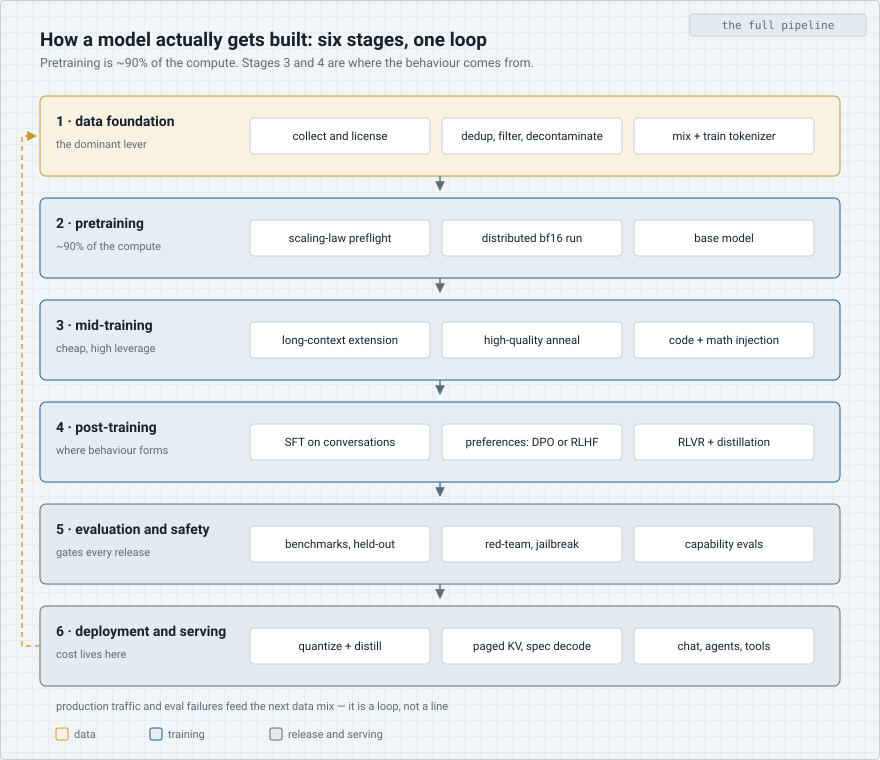

 
| Stage | What happens | Share of total compute | In this repo? |
|---|---|---|---|
| 1 · Data foundation | Collect, filter, dedup, tokenize | small compute, huge effort | `data.py`, `tokenizer.py` |
| 2 · Pretraining | The long run that makes a **base foundation model** | ~90% | `training.py`, `muon.py`, `scale.py` |
| 3 · Mid-training | Long context, code, math injected on top | ~2–5% | ✗ not covered inside repo|
| 4 · Post-training | SFT → preferences → RL. Behaviour forms here | ~5% | `sft.py` only for now |
| 5 · Evaluation & safety | Benchmarks, red-teaming, Alignment capability tests | small | `evaluation/` |
| 6 · Deployment | Quantize, serve, run as chat or agent | ongoing, forever | `gguf.py`, `precision.py`, `generation.py` |
 
2 things jump out. Pretraining eats almost all the compute — 
and almost none of the *character* of the model comes from it.

And stages 3 and 4, which are cheap, are where
"this model is good at coding" or "this model refuses politely" actually gets decided.


1. **Pretraining makes it knowledgeable. Post-training makes it useful.** They are different
   phases with different data, different objectives, and a 20:1 compute ratio.
2. **Data quality beats architecture.** Every clever attention variant in Part 3 is worth a
   few percent. Better data is worth multiples.
3. **The big change since 2023 is RL against checkable answers.** Reward from a unit test
   instead of from an opinion — that is what produced reasoning models.
4. **It's a loop, not a line.**

This repo is a complete, honest implementation of **stages 1, 2, 5 and 6**, plus the SFT
half of stage 4:
 
* `data.py`, `code_data.py`, `tokenizer.py` — stage 1
* `training.py`, `muon.py`, `scale.py`, `precision.py`, `shards.py` — stage 2
* `sft.py` — the first phase of stage 4
* `evaluation/` — stage 5
* `generation.py`, `gguf.py`, `hf_export.py`, `release.py` — stage 6

**Not covered: stage 3, and the RL half of stage 4.** That is a deliberate scope choice, not
an oversight — but it does mean that if you read only this repo, you will understand exactly
how a base foundation model is built and will have seen none of the machinery that turns one into a
reasoning model. and that big model can later be distilled into smaller quantized model 


more on this on part 8

# on model Abliteration:
Your MiniFrontier models (tiny_edu, tiny_modern, and the larger presets) are pure next-token predictors. 
They have not been safety-aligned with the kind of refusal training (SFT on refusal examples + RLHF/DPO) that creates a strong, concentrated “refusal direction.” in the safetensors file

Why the refusal direction doesn’t exist here
The phenomenon  appears in models that were deliberately trained to refuse certain requests. 
That training causes the model to reliably write a particular direction into the residual stream when it decides to refuse.  

this models were never given that training signal, so they do not develop (or only very weakly develop) such a refusal direction. 
A base or lightly SFT’d model will usually just continue the text, hallucinate, or produce incoherent output , 
rather than issue a clean “I cannot fulfill this request.”

Where it would live if the model were aligned
Conceptually, the residual stream is exactly the place the literature talks about. 
In your code that stream is the tensor named hidden (or inputs inside the blocks):

model.py – MiniFrontier.forward:
hidden = self.token_embedding(tokens)          # residual stream starts here

for block in self.blocks:
    hidden = block(hidden, ...)                # each block reads and writes to it

hidden = self.final_norm(hidden) # harmful vs harmless activation difference


Inside every TransformerBlock the two places that write into the residual stream are:Attention output projection
src/minifrontier/attention.py → self.out_proj
SwiGLU down projection
src/minifrontier/layers.py → self.down_proj

These are precisely the matrices that abliteration orthogonalizes (W_new = W - (W · r̂)r̂) 
in aligned models.
You can also read the residual-stream activations at any layer by hooking the output of TransformerBlock.

forward or the inputs to the final norm — 
that is where researchers record the harmful vs harmless activation difference to extract r⃗\vec{r}\vec{r}
.
Matrices that would be edited to abliterat model: out_proj and down_proj

So the geometric idea is fully compatible with your architecture, but the specific refusal feature itself is absent because of how (and how little) the models have been trained.


---

# Part 4 — Vocabulary → where it lives in the code

| Word | Kid version | Where |
|---|---|---|
| Token | LEGO piece of text | `tokenizer.py` |
| Embedding | Meaning card for each token | `model.py` — `token_embedding` |
| Residual stream | The conveyor belt carrying cards | the `+` in `TransformerBlock` |
| RMSNorm | Volume knob | `layers.py` |
| RoPE | Position stamp / twist | `rope.py` |
| Q / K / V | "what I want" / "what I am" / "what I give" | `attention.py` |
| Causal mask | No peeking at the future | `masking.py` |
| Head | One listener with one job | `n_heads` |
| MHA | Everyone has their own everything | `tiny_edu` |
| GQA | Askers share note-takers | `n_kv_heads < n_heads` |
| QK-Norm | Resize cards before comparing | `q_norm` / `k_norm` |
| SwiGLU | Thinking room with a dimmer switch | `layers.py` |
| Logits | Scoreboard over all possible next tokens | `lm_head` output |
| Softmax | Turn scores into percentages | `generation.py` |
| Loss | Surprise-o-meter | `loss.py` |
| KV cache | Notebook so you don't re-read the book | `cache.py` |
| Ring cache | Whiteboard with limited slots | `LayerKVCache(ring=True)` |
| Temperature / top-k / top-p | How adventurous the pick is | `sample_next_token` |
| SFT | Learning to answer, not just continue | `sft.py`, `train/sft.py` |
| FIM | Learning to fill a hole in the middle (for code) | `code_data.py` |

---

# Part 5 — Suggested reading order

Don't open `model.py` first. Go bottom-up — every file below depends only on the ones above
it:

1. **`config.py`** — every architecture decision, in one dataclass, with validation that
   tells you which combinations are illegal and why.
2. **`layers.py`** — 44 lines. `RMSNorm` and `SwiGLU`. Read the whole thing.
3. **`rope.py`** — 64 lines. Position stamps.
4. **`masking.py`** — 36 lines. Full vs sliding-window, in one boolean expression.
5. **`attention.py`** — read `manual_scaled_dot_product_attention` first, ignore the fast
   paths on your first pass.
6. **`model.py`** — `TransformerBlock` (30 lines), then `MiniFrontier.forward`.
7. **`loss.py`** — the shift-by-one trick.
8. **`generation.py`** — the guessing loop, for real.
9. **`cache.py`** — only once everything above makes sense.

Then the labs, in this order — `02_mha_vs_gqa.py`, `03_qk_norm.py`, `04_full_vs_hybrid.py`,
`07_rope_vs_global_nope.py`, `06_adamw_vs_muon.py`. (Some labs are still placeholders that
raise `SystemExit`; the tests in `tests/` cover the same ground meanwhile.)

And the tests are documentation. `tests/test_model.py` and `tests/test_attention.py` are
short, and they show what each piece is *supposed* to do.

---

# Part 6 — Things people get wrong at the start

**"It understands the question."** It produces text that fits the question. Whether that
counts as understanding is a real argument with smart people on both sides — but mechanically
what happens is next-token prediction, and it's worth holding both facts at once.

**"It knows when it's wrong."** It has no separate truth-check. Confident tone and correct
content are produced by the same machinery, which is exactly why confident wrong answers are
so common. Verify anything that matters.

**"Bigger context = better memory."** Bigger context means more tokens re-sent each turn. It
still has no memory between separate conversations unless something explicitly saves and
re-injects text.

**"The model is doing the maths."** For arithmetic it's pattern-matching digit sequences,
which is why small models fail at long multiplication that any calculator handles. Models
that are good at maths usually got there through specific training or by writing and running
actual code.

**"Attention is complicated."** It's a weighted average. The weights come from comparing
each token's question against every token's name tag. That really is the whole idea — the
complexity in production code is all about making that average fast and memory-cheap.

**"I need to understand the maths before the code."** You don't. Read `layers.py` and
`masking.py` — 80 lines total — and half the mystery evaporates. That's what this whole repo
is for.


---

# Part 7 — AI from first principles - history of LLM


To understand how we went from foundational computer science principles to modern small Large Language Models (SLMs), we have to trace how we taught machines to represent text, predict the next word, and drastically shrink that capability into highly efficient packages.Here is the evolutionary journey from first principles to modern SLMs.**1\. First Principles: Text as Math**At the most basic level, computers only understand numbers, not text. The first step was turning words into mathematical objects.

*   **One-Hot Encoding:** Early systems gave every word its own unique index in a massive vocabulary array. If you had 50,000 words, the word "cat" was an array of 49,999 zeros and a single one.
    
    *   _The Problem:_ Words had no mathematical relationship to each other. In this system, "cat" was just as distant from "kitten" as it was from "refrigerator."
        
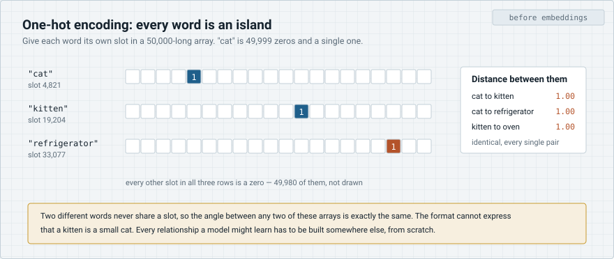

*   **Distributional Semantics:** The breakthrough principle came from linguist John Rupert Firth (1957): _"You shall know a word by the company it keeps."_
    
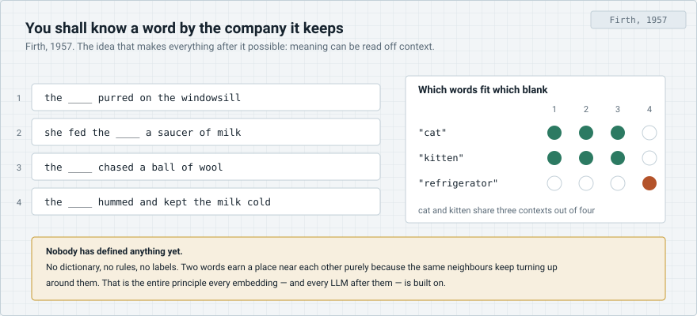

*   **Embeddings (Word2Vec):** In 2013, researchers began training shallow neural networks to predict words based on their neighbors. This created vectors (dense arrays of numbers, like coordinates in space). For the first time, "cat" and "dog" lived near each other in a mathematical landscape, allowing for vector arithmetic (e.g., King - Man + Woman = Queen).
    
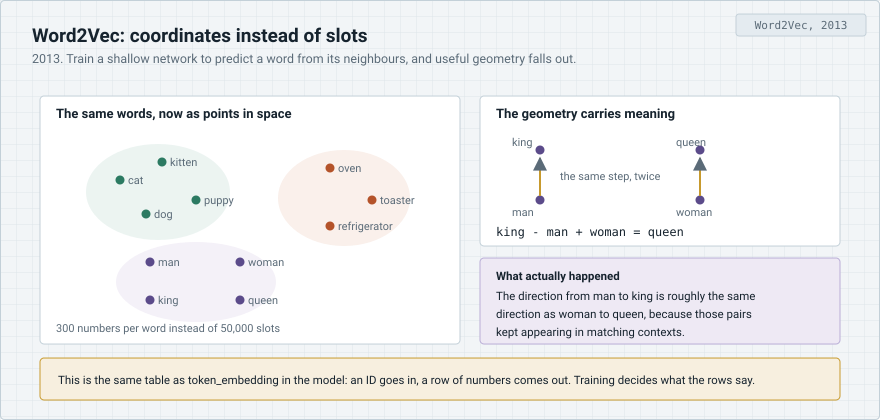

 **Single Artificial neuron**:
1) Weighted sum of inputs + bias  
2) Non-linearity (like the sigmoid “S-curve”)  
3) Goal: minimize the distance between prediction and truth

That is the actual atomic building block that everything else (MLPs, Transformers, LLMs) is made of. 

From a single artificial neuronEverything starts with one simple unit. 
An artificial neuron does three things and nothing more:It multiplies its inputs by learned weights and adds a bias (a weighted sum).  
It bends the result with a non-linear curve (classically a sigmoid, later ReLU, SiLU, etc.).  
It adjusts its weights so that its output gets closer to the truth.

That gentle non-linearity is the entire reason deep networks can separate data that no straight line could. 
Stack many of these units into layers, connect the layers, and you get a neural network. 
The Transformer is just a particularly clever way of arranging and connecting these units so they can look at an entire sequence at once.


1. Weigh its inputs (weighted sum + bias)
This is done by every nn.Linear layer.In tiny_modern the most important ones are:

Attention projections (src/minifrontier/attention.py):

self.q_proj = nn.Linear(..., bias=False)
self.k_proj = nn.Linear(..., bias=False)
self.v_proj = nn.Linear(..., bias=False)
self.out_proj = nn.Linear(..., bias=False)

Feed-forward (SwiGLU) (src/minifrontier/layers.py):

self.gate_proj = nn.Linear(d_model, d_ff, bias=False)
self.up_proj   = nn.Linear(d_model, d_ff, bias=False)
self.down_proj = nn.Linear(d_ff, d_model, bias=False)

Final scoreboard (src/minifrontier/model.py):

self.lm_head = nn.Linear(d_model, vocab_size, bias=False)


2. Bend the result with a curve (non-linearity)
This is the activation function.
In your code it happens mainly here:
SwiGLU (src/minifrontier/layers.py, line ~100):

return self.down_proj(F.silu(self.gate_proj(inputs)) * self.up_proj(inputs))

F.silu is the non-linearity (SiLU / Swish = x⋅σ(x)x \cdot \sigma(x)x \cdot \sigma(x)
).
This is the modern replacement for the classic sigmoid or ReLU.

There is no classic sigmoid left in the model. 
Softmax appears only at the very end when turning logits into probabilities (during generation or loss), not inside the residual stream.

3. Quietly shrink its own mistakes (learning)
This does not happen inside the model forward pass.
It happens during training:Loss calculation → src/minifrontier/loss.py (next_token_loss)
Backpropagation → automatic via loss.backward()
Weight update → the optimizer in src/minifrontier/training.py (AdamW by default, or Muon in the experimental lab)

Every time you call the training loop, PyTorch computes gradients for all the nn.
Linear weights (and the RMSNorm scales) and the optimizer nudges them to make the next-token predictions less surprising.


**2\. The Architecture Evolution: Processing Sequences**Language has order and context. How do you feed a sequence of words into a network?

*   **Recurrent Neural Networks (RNNs):** These networks processed words one by one, keeping a running "memory" of the sentence.
    
    *   _The Problem:_ They suffered from "forgetting" early parts of long sentences (vanishing gradients) and were incredibly slow because they could not process text in parallel.
        
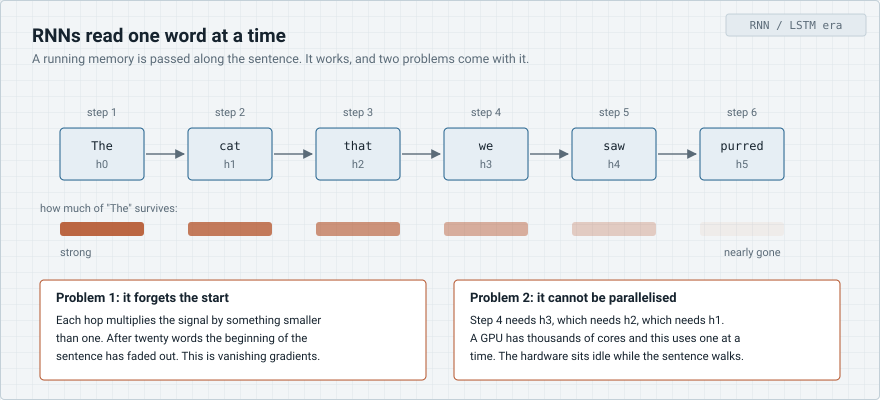

*   **The Transformer Breakthrough (2017):** The landmark paper _"Attention Is All You Need"_ discarded recurrence entirely. It introduced **Self-Attention**. Instead of reading left-to-right, a Transformer looks at every word in a sentence simultaneously and calculates how much weight or "attention" each word should pay to every other word. This allowed for massive parallel processing on modern GPUs.
    
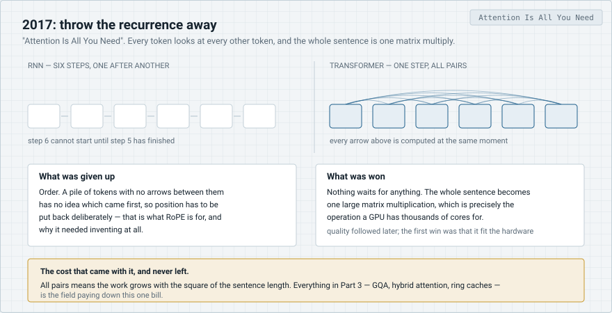

**3\. Scaling Up: The Birth of LLMs**With the Transformer architecture, AI entered the scaling era.

*   **Next-Token Prediction:** LLMs are essentially highly advanced auto-completers. They are trained on massive datasets to predict the very next "token" (a word or piece of a word) given all the tokens that came before it.
    
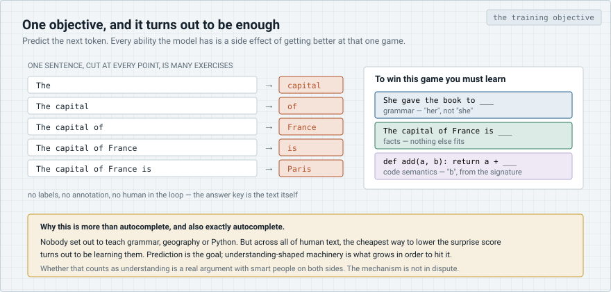

*   **The Scaling Laws (2020):** Researchers discovered that as you increase the number of parameters (the internal configuration settings of the model), the dataset size, and the compute power, the model’s performance improves predictably. This sparked a race to build massive models (e.g., GPT-3 at 175 billion parameters).
    
*   **Emergent Abilities:** At massive scales, these models stopped just copying text and began showing "emergent" behaviors—like reasoning, coding, and translation—that they weren't explicitly programmed to do.
    
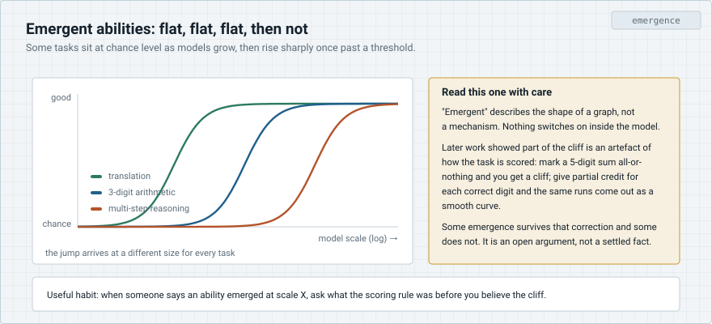

**4\. The Pivot to Small LLMs (SLMs)**While 175B+ parameter models are powerful, they are incredibly expensive to run, slow, and cannot fit on everyday hardware like smartphones or laptops. The industry pivoted to ask: _How small can we make these models while keeping them smart?_Modern SLMs (usually between 1 billion and 8 billion parameters, like Llama 3 8B, Phi-3, or Gemma) achieved high capability through several key innovations:

*   **Higher Quality Data:** The Chinchilla paper (2022) revealed that older large models were actually "under-trained" on too little data. Modern SLMs are trained on vastly more tokens than their predecessors (e.g., Llama 3 8B was trained on 15 trillion tokens). Quality also matters; synthetic data generated by larger models is used to teach smaller models pristine logic and reasoning.
    
*   **Knowledge Distillation:** This is a teacher-student framework. A massive LLM (the teacher) runs through a dataset, and the SLM (the student) is trained not just on the raw text, but to mimic the precise probability distributions and reasoning steps of the larger model.
    
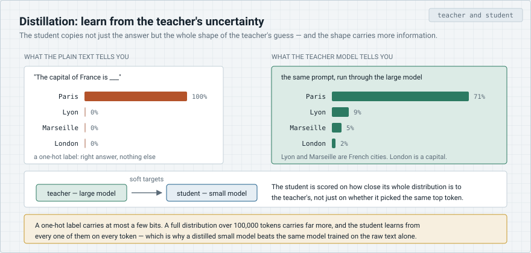

*   **Quantization:** A first-principle physics and computer science trick. Models are normally trained using high-precision numbers (16-bit floating points). Quantization compresses these numbers down to 8-bit or even 4-bit integers. This reduces the memory footprint by 75% or more, allowing a highly capable model to run directly on a consumer smartphone chip without a massive drop in accuracy.
    
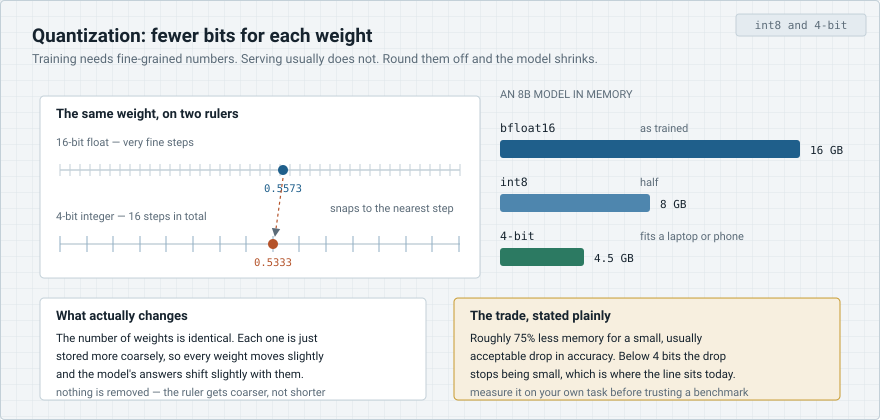

*   **Architectural Refinements:** Technologies like Grouped-Query Attention (GQA) reduce memory usage during inference, making the models significantly faster and less power-hungry.
    

**Summary of the Journey**

*   **First Principles:** Turn words into vectors so math can represent meaning.
    
*   **Transformers:** Use self-attention to process entire sequences of vectors simultaneously.
    
*   **LLMs:** Scale parameters and data to the extreme to trigger emergent reasoning.
    
*   **SLMs:** Refine the data quality, extend training duration, and compress/quantize the math so that same reasoning power can run locally in your pocket.

-------------------------

## Why the hallucination / Confusing, Repetitive, Self-Referential Behavior Happens in LLMs

What people sometimes call “AI psychosis” is not a rare bug. It is the model doing exactly its job under unfavorable conditions:

- **Inherent hallucination**  
  The model generates text that *pattern-matches* as plausible. It has no separate mechanism that verifies whether the text is true. When the conversation enters a region with weak or conflicting patterns, it continues producing fluent but incorrect or nonsensical continuations.

- **Autoregressive feedback loop**  
  Every token the model generates is immediately fed back as part of its own context. A few odd sentences quickly become the new “normal.” The model then keeps guessing on top of its own previous mistakes, producing repetitions, topic mixing , apologetic language, or self-referential statements and hallucinations.

- **Sampling parameters**  
  Higher temperature flattens the probability distribution, increasing the chance of less-likely (and therefore often stranger) tokens. Combined with a drifting context, this accelerates the descent into nonsense.


The same core mechanism exists in every major modern LLM (Grok, Claude, GPT, Gemini,Muse, etc.). Larger models with more data and better training simply enter these failure modes less often and recover more gracefully.


### 1. `src/minifrontier/generation.py` — the runtime loop

- **`sample_next_token`**  
  Takes the model’s logits, applies temperature scaling, optional top-k and top-p (nucleus) filtering, converts them to probabilities, and samples one token. This is where “how adventurously we guess” is decided.

- **`generate`**  
  The actual autoregressive loop:
  1. Prefill the entire prompt once and populate the KV cache.
  2. For each new step:
     - Sample the next token.
     - Append it to the output.
     - Feed **only** the newly chosen token back into the model (using the cache).
     - Receive fresh logits for the following position.
  3. Repeat until the length limit or an EOS token.

Every generated token becomes part of the context for the next prediction. This is precisely the mechanism that can turn a few bad guesses into a runaway loop of nonsense.

### 2. `src/minifrontier/model.py` — producing the scores

### 3. `src/minifrontier/loss.py` — how the model is trained to guess

`next_token_loss` measures how surprised the model is by the true next token (cross-entropy after shifting the sequence). 
Training repeatedly reduces this surprise across vast amounts of text. There is still no truth filter — only a statistical pressure to make the correct continuation less surprising.


# Part 8 —  How a real AI model actually gets built

## 8 Stage 1 — Data foundation
 
In 2020 people thought architecture was the lever. It wasn't. **Data is the lever.** Most
of the published quality gains of the last three years came from better data, not better
maths.
 
Four jobs live here:
 
* **Collect and license.** Web crawls, books, code repositories, licensed corpora.
* **Deduplicate.** The same article appears on 400 sites. Training on it 400 times teaches
  the model to memorize instead of generalize.
* **Filter for quality.** Usually with a small classifier model that scores "does this look
  like something worth learning from?" — machine-generated spam is filtered out by machine.
* **Decontaminate.** Strip the benchmark test sets *out* of the training data. Skip this and
  your evaluation scores are fiction: the model has simply seen the answers.
Then the tokenizer is trained on the final mix (`tokenizer.py`), and the mix proportions get
tuned — 40% web, 20% code, 10% math, and so on. Those proportions are one of the most
closely guarded numbers at any lab.
 
**Increasingly, a lot of this data is synthetic** — written by an existing model, then
filtered. That sounds circular, and it partly is, but a strong model producing carefully
verified examples turns out to be a very cheap way to make training data for the next one.
 
---
 
## 8.3 Stage 2 — Pretraining
 
This is section 2.7 of this document, scaled up by a factor of a million. Hide the next
token, guess it, measure the surprise, nudge the weights. Nothing more exotic than that,
running for weeks across thousands of GPUs.
 
What is different at scale:
 
* **Scaling-law preflight.** You do *not* start a $50M run and hope. You train a ladder of
  tiny models, fit a curve, and predict what the big one will do. `scale.py` in this repo is
  the toy version of exactly that.
* **Distributed training.** The model does not fit on one GPU, so it gets sliced — across
  layers, across the width of each matrix, across the batch.
* **Precision.** Weights in bf16 or fp8 rather than fp32. Half the memory, double the speed,
  and a whole category of new numerical bugs.
* **The optimizer matters again.** For a decade AdamW was the only answer. Muon and its
  relatives (`muon.py`) now regularly beat it.
Out the other end comes a **base foundation model**. It is not a chatbot. It cannot hold a conversation.
It only continues text. Give it "The capital of France is" and it says "Paris"; give it
"How are you?" and it might reply with three more questions, because that is what a list of
questions looks like on the internet.
 
---
 
## 8.4 Stage 3 — Mid-training
 
This phase did not have a name in 2023 and is the biggest gap in the older diagrams.
 
The idea: pretraining runs at a short context — 4k or 8k tokens — because attention cost
grows with the square of the sequence length (section 3.3). Doing the whole run at 128k
would be absurdly expensive. So you pretrain short, then **extend afterwards** in a short,
cheap phase:
 
* **Long-context extension.** Increase RoPE's `rope_theta` so the rotations turn more slowly
  and reach further (section 2.2), then train briefly on genuinely long documents.
* **High-quality anneal.** Near the end, swap the fire-hose of web text for a small, very
  clean mix and let the learning rate decay into it. The model's last impressions stick.
* **Domain injection.** Heavy doses of code and mathematics, because these are where
  capability transfers most broadly.
A few percent of the compute, a large share of what the finished model can do.
 
---
 
## 8.5 Stage 4 — Post-training
 
The old diagram has one arrow here labelled "finetuning". It is now three or four distinct
phases, and it is where a base model becomes an assistant.
 
**1. SFT — supervised finetuning.** Show the model thousands of example conversations and
train it to imitate the assistant's half. This is `sft.py` in this repo, and the `loss_mask`
you saw in `model.forward` exists precisely for this: score only the assistant's tokens, not
the user's. SFT teaches *format*: turn-taking, following instructions, using tools.
 
**2. Preference optimization.** SFT teaches one valid answer. But usually several answers
are valid and humans still prefer one. So you collect pairs — "answer A is better than
answer B" — and train the model to raise the probability of A relative to B. DPO does this
directly from the pairs; the older RLHF route trains a separate reward model first and then
runs PPO against it.
 
**3. RLVR — reinforcement learning from verifiable rewards.** The big one, and the reason
2026 models differ so much from 2023 models at the same size.
 
The insight is embarrassingly simple. For preferences you need a human, or a model
imitating a human, to say which answer is better — expensive and noisy. But for a large
class of problems **you can just check the answer**:
 
* Code → run the unit tests. Pass or fail.
* Maths → verify the final result symbolically. Correct or not.
* A build → does it compile?
So: let the model attempt a problem many times, keep what worked, push the weights toward
it. The reward comes from a checker, not from an opinion. Run this long enough and the model
starts to *think before answering* — writing out a long chain of reasoning, catching its own
mistakes — not because anyone taught it that format, but because it raises the pass rate.
 
The dominant algorithm is **GRPO**, introduced by DeepSeek. Its trick is that it needs no
separate value network: it takes a group of attempts at the same prompt and uses that
group's own average score as the baseline. Cheaper and simpler than PPO, which is most of
why it took over.
 
**4. Distillation.** A big expensive model teaches a small cheap one. Two flavours:
 
* *Off-policy* — generate a pile of the teacher's answers and fine-tune the student on them.
  This is how the DeepSeek-R1-Distill models were made.
* *On-policy* — the student generates, and the teacher scores its output token by token.
  Slower per step, dramatically more sample-efficient, and now the standard final phase in
  most open-model recipes.
In 2026 distillation is also used to **merge** capabilities: train several specialists with
RLVR — one for maths, one for code, one for agentic tool use — then distil all of them into
a single model. RLVR builds the specialists; distillation fuses them.
 
---
 
## 8.6 Stage 5 — Evaluation and safety
 
Not a footnote. It is a gate: a model that fails here does not ship.
 
* **Benchmarks and held-out evals.** Public ones for comparison, private ones because public
  ones leak into training data within months.
* **Red-teaming.** People and automated attackers try to make the model do things it
  shouldn't, including through multi-turn attacks that succeed where single-turn refusals
  hold firm.
* **Capability evaluations.** Testing specifically for dangerous capabilities. Every major
  lab now publishes a policy tying release decisions to these results.
The honest caveat: benchmark scores are the *least* reliable part of any model announcement,
because contamination is hard to rule out and everyone is optimizing for the same numbers.
 
---
 
## 8.7 Stage 6 — Deployment
 
Training happens once. Serving happens a billion times, so this is where the money goes.
 
* **Quantization.** 16-bit weights down to 8 or 4 bits. `gguf.py` and `precision.py` cover
  this — it's how a 30B model fits on a laptop.
* **KV cache management.** Section 2.8 showed *why* the cache exists. At production scale it
  is the binding constraint: paged allocation so one long conversation doesn't fragment
  memory for everyone else. GQA and the hybrid local/global pattern from Part 3 exist almost
  entirely to shrink this.
* **Speculative decoding.** A small draft model guesses several tokens ahead; the big model
  verifies them in one pass. Same output, several times faster.
* **The product layer.** Chat, tool calling, agents, retrieval. Note what is *not* here any
  more: "finetune the base model into a text classifier" was a sensible 2023 endpoint and is
  now a rounding error — you'd use embeddings or a tiny specialist model instead.
---
 
## 8.8 The ai model stages loop
 
The arrow that the linear diagrams all miss: **stage 6 feeds back into stage 1.** Production
traffic shows what users actually ask. Evaluation failures show what the model can't do.
Both become training data for the next run. Model development is a cycle with a period of
roughly three to six months, not a pipeline with an end.