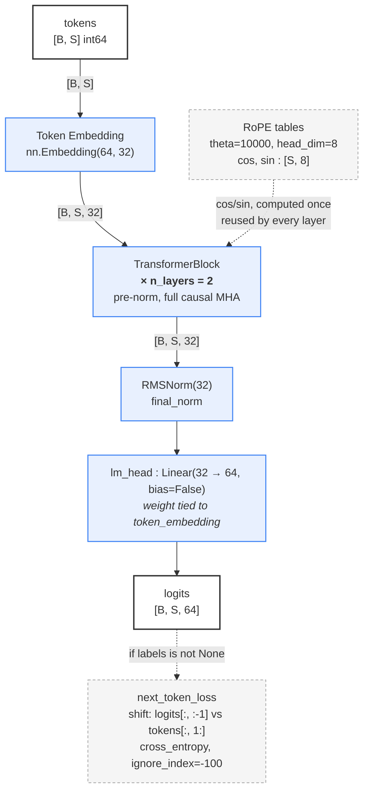
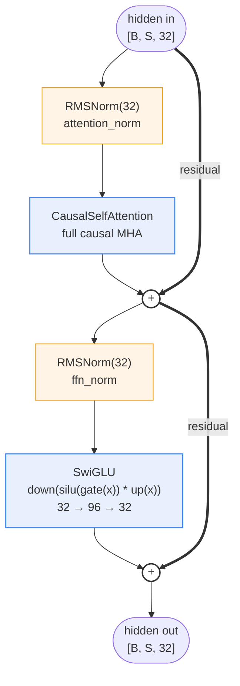
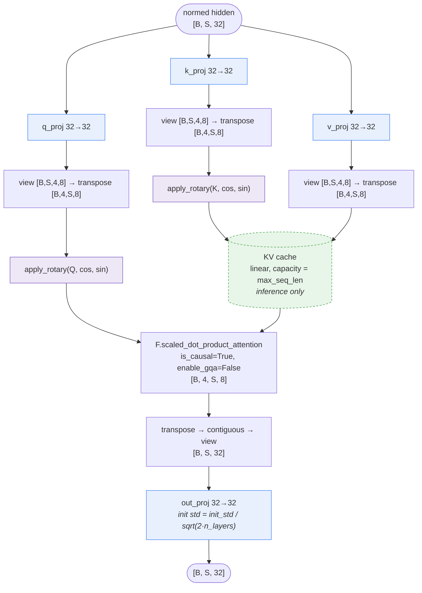
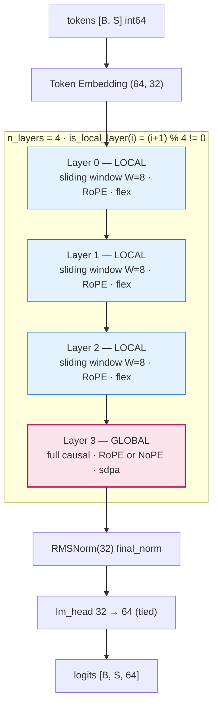
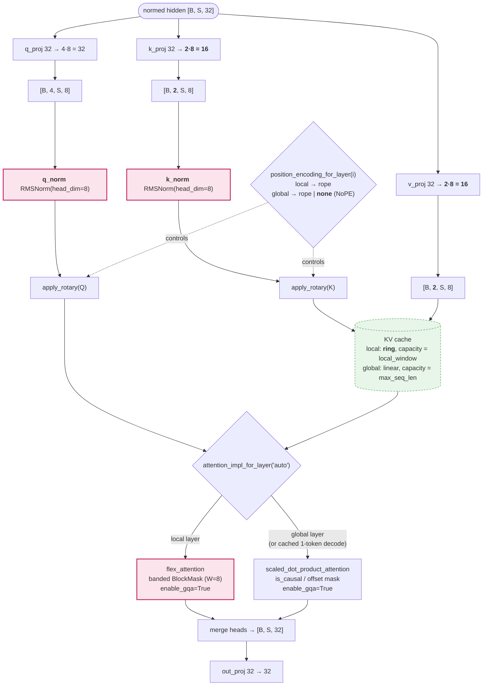
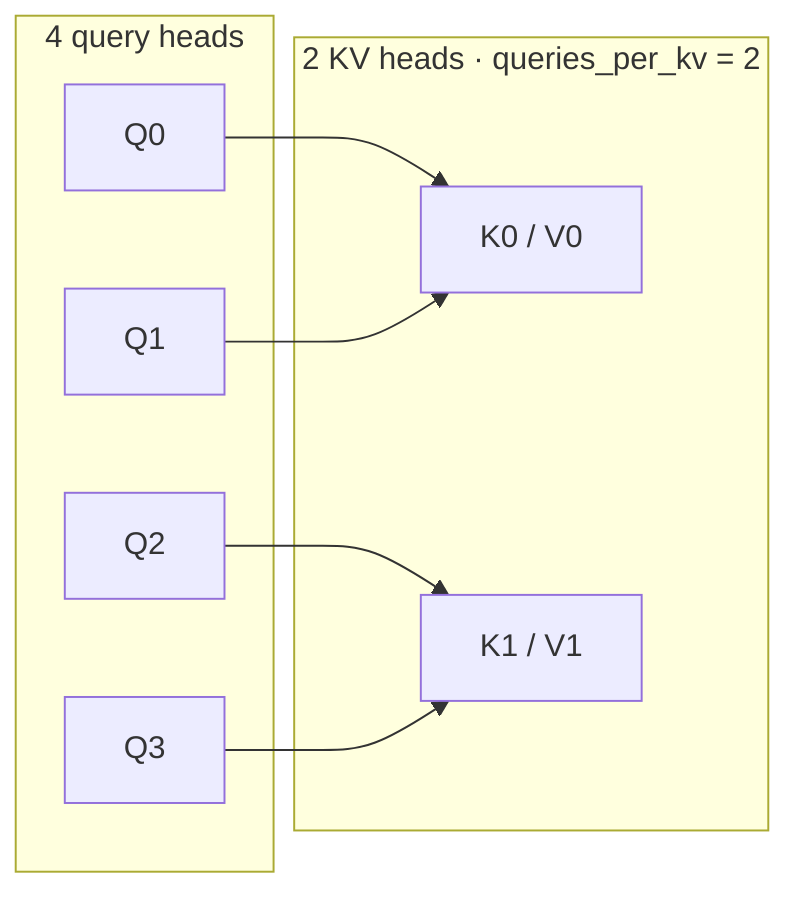
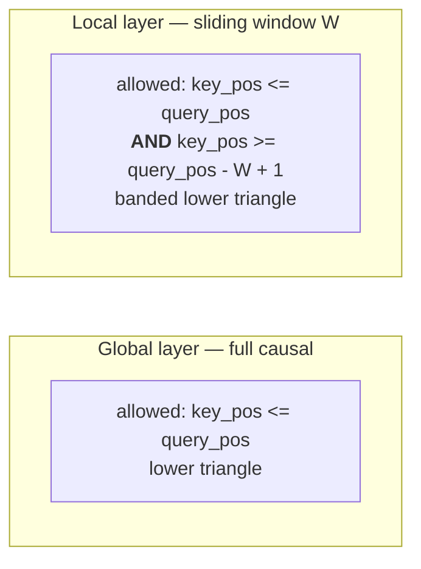
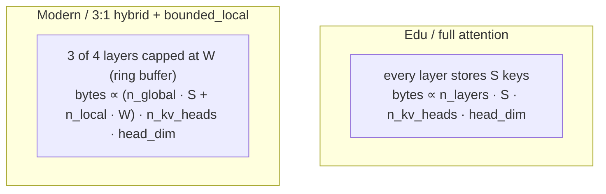

# MiniFrontier — architecture diagram sources

Drawn from `src/minifrontier/{config,model,attention,layers,rope,cache,masking,loss}.py`.

Shapes below use the `tiny_*` factory defaults:

| | `tiny_edu()` | `tiny_modern()` |
|---|---|---|
| vocab / max_seq_len | 64 / 32 | 64 / 32 |
| n_layers | 2 | 4 |
| d_model | 32 | 32 |
| n_heads / n_kv_heads | 4 / 4 (MHA) | 4 / 2 (GQA) |
| head_dim | 8 | 8 |
| d_ff | 96 | 96 |
| qk_norm | false | true |
| attention_pattern | full | hybrid (3:1) |
| local_window | 16 (unused) | 8 |
| global pos. encoding | rope | rope (or `none` = NoPE) |
| attention_impl | sdpa | auto → flex local / sdpa global |
| tie_embeddings | true | true |
| params | ~28,832 | ~51,552 |

---

## How to draw these like a paper figure

The Vaswani-style look is four conventions, not one big picture:

1. **One vertical column, bottom-to-top.** Tokens at the bottom, logits at the top.
2. **The repeated block is drawn once**, inside a dashed rounded rectangle labelled `N×`.
   Never unroll 20 layers.
3. **The residual stream is a line that goes around the sublayer**, meeting it at a small
   `⊕` circle. That bypass line is the single most important visual in a transformer
   diagram — make it thicker/darker than the sublayer boxes.
4. **Shapes annotate edges, not boxes.** `[B, S, 32]` on the arrow; the box says what the
   op is.

Mermaid can express 1–3 but draws `⊕` as a node and cannot route a clean bypass curve, so
the residual looks like a fork rather than a loop. For a talk slide, use Mermaid to fix the
topology and then trace it into SVG (or hand-edit the scaffold at the bottom of this file)
so the residual reads as a bypass.

Level of detail that works: **three diagrams per preset** — model column, one block,
attention internals. Zoom in, same visual language each time.

---

# 1. `tiny_edu`

## 1a. Model column



## 1b. Inside one Edu block



## 1c. Edu attention internals



> Note for the slide: `manual_scaled_dot_product_attention` in `attention.py` is the
> teaching twin of the `sdpa` box — `softmax(QKᵀ/√d + mask) · V` in FP32 with an explicit
> boolean `[S_q, S_k]` mask from `build_attention_mask`. Same math, drawn identically;
> only the label changes.

---

# 2. `tiny_modern`

Structurally identical column. Every difference is inside attention plus one per-layer
routing decision. Draw the same three diagrams and colour the four deltas.

## 2a. Model column with layer-type strip



At 150M scale (`n_layers=20`) the globals are layers 3, 7, 11, 15, 19 — so the last layer
is always global. Worth saying out loud when teaching.

## 2b. Modern attention internals — the four deltas



Ordering matters and is easy to get wrong on a slide: **QK-Norm runs before RoPE**
(`attention.py`, lines 171–176).

## 2c. GQA head-sharing inset



> `manual` is the only path that materializes the repeat
> (`_expand_kv_for_reference` → `repeat_interleave`). `sdpa` and `flex` broadcast
> internally via `enable_gqa=True`. Draw the dotted "logical expansion" once, then say the
> fast kernels skip it.

## 2d. Sliding-window vs full mask (optional, very effective on a slide)



Both come from the same `build_attention_mask(...)` with/without `window_size`, and the
Flex `mask_mod` closure encodes exactly the same two predicates. Draw them as two 8×8
grids of filled/empty cells — that single picture explains the whole hybrid.

## 2e. KV cache growth (the payoff slide)



`LayerKVCache` reports both `allocated_bytes()` and `logical_bytes()` — useful pair of
numbers to put on the slide instead of a hand-waved claim.

---

# 3. SVG scaffold

Column layout, `⊕` residual bypasses, arrowhead marker, `N×` dashed frame. Open it, edit
the text nodes, extend upward. Coordinates are on a 40px grid so blocks stay aligned.

```svg
<svg xmlns="http://www.w3.org/2000/svg" viewBox="0 0 520 760" width="520" height="760"
     font-family="Inter, system-ui, sans-serif" font-size="13">
  <defs>
    <marker id="arrow" viewBox="0 0 10 10" refX="9" refY="5"
            markerWidth="6" markerHeight="6" orient="auto-start-reverse">
      <path d="M 0 0 L 10 5 L 0 10 z" fill="#333"/>
    </marker>
    <style>
      .box   { fill:#e8f0fe; stroke:#4285f4; stroke-width:1.5; rx:6; }
      .norm  { fill:#fff4e5; stroke:#f59e0b; stroke-width:1.5; rx:6; }
      .io    { fill:#ffffff; stroke:#333;    stroke-width:2;   rx:6; }
      .frame { fill:none; stroke:#888; stroke-width:1.5; stroke-dasharray:6 4; rx:10; }
      .edge  { stroke:#333; stroke-width:1.5; fill:none; marker-end:url(#arrow); }
      .res   { stroke:#111; stroke-width:2.5; fill:none; marker-end:url(#arrow); }
      .lbl   { fill:#555; font-size:11px; }
      text   { text-anchor:middle; dominant-baseline:middle; fill:#111; }
    </style>
  </defs>

  <!-- bottom: input -->
  <rect class="io" x="180" y="700" width="160" height="40"/>
  <text x="260" y="720">tokens [B, S]</text>
  <path class="edge" d="M260,700 L260,660"/>

  <rect class="box" x="160" y="620" width="200" height="40"/>
  <text x="260" y="640">Token Embedding (V, d)</text>
  <text class="lbl" x="330" y="608">[B, S, d]</text>
  <path class="edge" d="M260,620 L260,580"/>

  <!-- repeated block -->
  <rect class="frame" x="60" y="230" width="400" height="350"/>
  <text x="400" y="250" font-weight="600">N ×</text>

  <!-- attention sublayer -->
  <rect class="norm" x="180" y="500" width="160" height="36"/>
  <text x="260" y="518">RMSNorm</text>
  <rect class="box"  x="180" y="430" width="160" height="44"/>
  <text x="260" y="452">Causal Self-Attention</text>
  <circle class="io" cx="260" cy="390" r="16"/>
  <text x="260" y="390">+</text>
  <path class="edge" d="M260,500 L260,474"/>
  <path class="edge" d="M260,430 L260,406"/>
  <!-- residual bypass: out to the left, up, back in -->
  <path class="res" d="M260,560 L120,560 L120,390 L244,390"/>

  <!-- feed-forward sublayer -->
  <rect class="norm" x="180" y="320" width="160" height="36"/>
  <text x="260" y="338">RMSNorm</text>
  <rect class="box"  x="180" y="250" width="160" height="44"/>
  <text x="260" y="272">SwiGLU  d → d_ff → d</text>
  <circle class="io" cx="260" cy="205" r="16"/>
  <text x="260" y="205">+</text>
  <path class="edge" d="M260,374 L260,356"/>
  <path class="edge" d="M260,320 L260,294"/>
  <path class="edge" d="M260,250 L260,221"/>
  <path class="res" d="M260,374 L120,374 L120,205 L244,205"/>

  <!-- head -->
  <path class="edge" d="M260,189 L260,160"/>
  <rect class="norm" x="180" y="120" width="160" height="36"/>
  <text x="260" y="138">final RMSNorm</text>
  <path class="edge" d="M260,120 L260,96"/>
  <rect class="box" x="150" y="56" width="220" height="40"/>
  <text x="260" y="76">lm_head  d → V  (tied)</text>
  <path class="edge" d="M260,56 L260,32"/>
  <rect class="io" x="180" y="-8" width="160" height="40"/>
  <text x="260" y="12">logits [B, S, V]</text>

  <!-- side annotation -->
  <text class="lbl" x="440" y="452" text-anchor="end">RoPE cos/sin</text>
  <text class="lbl" x="440" y="468" text-anchor="end">computed once</text>
</svg>
```

To turn this into the Modern figure: add a `q_norm`/`k_norm` box between projection and
RoPE inside the attention zoom, recolour the block frame per layer type, and put the
`L L L G` strip as four small squares down the left gutter at `x≈30`.
